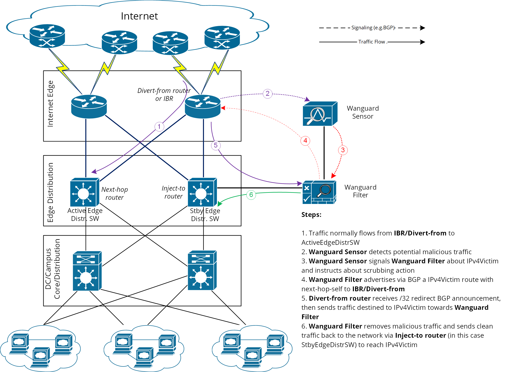

## 远程触发黑洞 RTBH

[44. Appendix 3 – Network Integration Guide — Wanguard User Guide documentation](https://docs.andrisoft.com/wanguard/8.5/Appendix_3__Network_Integration_Guideline.html#traffic-diversion-forwarding)

远程触发黑洞路由 (Remote triggered blackhole) 是一种通常用于缓解分布式拒绝服务 （DDoS） 攻击的技术。

黑洞路由通过BGP协议，将恶意流量重定向到“黑洞”（一个空接口，如 null0），从而永久丢弃这些流量。

RTBH 主要是基于目标 IP 地址进行流量过滤，但如果您需要 RTBH 基于源 IP 地址进行过滤，那么需要启用单播反向路径转发 (uRPF)。uRPF 必须应用于互联网传输连接或“链路”的两端，且在松散或严格模式下启用，才能实现基于源 IP 地址的 RTBH。


下图是一个简化的 ISP 网络架构：


```
1. 正常流量从 IBR 流向 Active EdgeDistrSW
2. Wanguard Sensor 通过分析从路由器接收的 IP 数据包，检测到针对受害者(在DC内部)的 DDoS 攻击
3. Wanguard Sensor 通过 BGP 发出针对受害者IP的黑洞路由信号
4. 一旦 IBR 接收到 /32 的黑洞公告，它就会对发往受害者的恶意流量进行黑洞处理，并带有特定BGP community属性的 /32前缀传播给上游ISP
```

在此拓扑中中，Wanguard Sensor 扮演 **Trigger** 或 **Manager**的角色 。检测到攻击后，它会通过 BGP 向 **IBR**（互联网边界路由器）发出信号，要求其必须丢弃所有发往 **受害者** 的流量：

 ● Wanguard Sensor 通过 BGP（带有特殊Community）  将受害者的IPv4 /32 前缀 通告给 IBR

 ● IBR 收到通知，并将 /32前缀 载入到其路由表中，下一跳为 Null0

 ● 然后，IBR 将此路由通告给其上游提供商 （ISP），同时将用于黑洞标识的 BGP community 传播给上游ISP


### Wanguard Sensor 与 IBR的BGP会话

wanguard 安装在 Linux 中，使用 FRRouting 来运行BGP会话

```bash
localhost# show running-config
... skipped ...
debug bgp events
debug bgp updates out
debug bgp filters
!
router bgp 399077
 network x.x.x.x 32               # >> 通告受害者的/32 IPv4地址, 正常情况下这条路由是由WG Sensor自动生成的
 bgp router-id 10.10.99.88
 no bgp network import-check      # BGP不会检查RIB中是否存在最优路由。（默认情况下，BGP只通告本地RIB中存在的最优路由）
 neighbor 10.25.16.5 remote-as 399077
 neighbor 10.25.16.5 description IBR-HKG01-BH-IBGP
 neighbor 10.25.16.7 remote-as 399077
 neighbor 10.25.16.7 description IBR-HKG02-BH-IBGP
 neighbor 10.25.16.9 remote-as 399077
 neighbor 10.25.16.9 description FW-OFFRAMP-IBGP
!
ip community-list standard RTBH-ALL permit 65077:666   # >> 用于标识黑洞的communtiy
ip community-list standard Off-Ramp permit 65077:668   # >> 用于引流的communtiy（引流到防火墙清洗/过滤攻击流量）
!
route-map RTBH-ALL permit 10
 set community 65077:666
!
route-map Off-Ramp permit 10
 set community 65077:668

... skipped ...
```


> [!TIP]
>
> 为了对来自上游的攻击进行黑洞，需要使用 BGP community 对黑洞路由进行标记 (tag)。
>
> 在 IBR 上，应有一个路由策略应用于 ISP 的 BGP 邻居 （export-direction），该策略应将内部 BH community 重写为 ISP 的 BH community 。
>
> 从 BGP 配置的角度来看，Wanguard 传感器的配置与 [Quagga 安装] (https://www.andrisoft.com/docs/wanguard/8.1/Configuration__Components__BGP_Connector.html#quagga-frr-installation)部分中列出的 Wanguard 过滤器的 BGP 配置非常相似，但有一个关于将用于标记黑洞路由的 BGP 社区的例外。考虑到这一点，将仅进一步详细介绍 IBR 的配置。


### IBR设备的BGP配置

```
set protocols bgp group bg_IBGP-WG_v4 neighbor 10.10.72.47 description BH-WG-SERVER
set protocols bgp group bg_IBGP-WG_v4 neighbor 10.10.72.47 local-address 10.10.72.46
set protocols bgp group bg_IBGP-WG_v4 neighbor 10.10.72.47 import ps_IBGP-BH-WG-IN
set policy-options community 65077:666 members 65077:666
set policy-options community BLACKHOLE members 65077:666
```


#### 1. IBR 与 WG Sensor 的 BGP 会话

以 Cisco 路由器为例：

```bash
ip bgp-community new-format
ip community-list <Wanguard-Sensor-BH-community-nameL> permit <RTBH-community>  # >> 定义用于黑洞的community-list和community值, 例如：65000:666  
!
route-map Wanguard-Filter-in permit 10
  match community <Wanguard-Sensor-BH-community-name>
  set local-preference 200                      # >> 确保这条重定向路由具有更高的优先级。
  set ip next-hop 10.255.255.255               # >> this target-IP must not be used on your network, 此目标 IP 不得在您的网络上使用
!
route-map Wanguard-Sensor-out deny 10 

ip route 10.255.255.255 255.255.255.255 Null0  # >> Null 路由(黑洞), 以便丢弃流量
!
router bgp <Router-AS-number>
  no synchronization
  bgp log-neighbor-changes
  neighbor <Wanguard-Sensor-IP-address> remote-as <Wanguard-Sensor-AS-number>
  neighbor <Wanguard-Sensor-IP-address> description <description>
  neighbor <Wanguard-Sensor-IP-address> soft-reconfiguration-inbound
  neighbor <Wanguard-Sensor-IP-address> route-map Wanguard-Sensor-out out
  neighbor <Wanguard-Sensor-IP-address> route-map Wanguard-Sensor-in in
  exit
```

#### 2. IBR 与上游  ISP 的 BGP 会话

```bash
route-map IBR-ISP1-out permit 5       # → assumes that additional entries are defined and allow customer-routes
  match community <Wanguard-Sensor-BH-community-name>
  set community <ISP1-BH-Community>   # → e.g.111:666

route-map IBR-ISP2-out permit 5
  match community <Wanguard-Sensor-BH-community-name>
  set community <ISP1-BH-Community>   # → e.g.222:666

router bgp <Router-AS-number>
  no synchronization
  neighbor <IPS1-IP> remote-as <ISP1-ASN>
  neighbor <IPS1-IP> route-map IBR-ISP1-out out
  neighbor <IPS2-IP> remote-as <ISP2-ASN>
  neighbor <IPS2-IP> route-map IBR-ISP2-out out
```

> [!tip]
>
> 当存在多个isp 和 多个IBR时，可以为每个IBR使用不同的BH community来定位攻击源，以避免所有到受害者的流量都陷入黑洞。


## 引流和回注

**Traffic Diversion & Forwarding** 又称流量

- **引流**  - 将受害者 IP 流量重定向到缓解服务器（防火墙清洗），又称 `流量转移/清洗`
- **回注 ** - 将清理后的流量发送回网络，最终到达受害 IP，又称 `流量转发/回注`


这种方法依赖于基本的最**长前缀匹配**路由原则。

使用BGP协议，向 IBR（互联网边界路由器）注入/通告 **重定向前缀**（例如，IPv4 为 /32，IPv6 为 /128）。IBR 是桥接 ISP 流量和内部（客户）网络的路由器。

Wanguard Filter（或 流量清洗防火墙） 会向 IBR 发送一条针对**受害者 /32**的 BGP 路由更新，下一跳指向自身，从而迫使 IBR 选择通过 Wanguard Filter 到达**IPv4 受害者**的路径。要使此方法奏效，主要条件是该重定向通告必须是 BGP 选举过程和路由表管理器（RTM）选出的最佳通告。

> [!note]
>
> 如果路由表中已存在类似的 / 32 路由，那么就必须进行额外配置，以确保重定向宣告能被插入到路由表中，并用于决定转发路径。

流量分流的工作原理如下图：



 流量清洗流程：

1. 正常流量从 **IBR/Divert-from **设备 流向 Active EdgeDistrSW。
2. **Wanguard Sensor** 检测到潜在的恶意流量。
3. **Wanguard Sensor** 向 **Wanguard Filter** 发送信号，告知 IPv4 受害者（IPv4Victim）的相关信息，并指示执行流量清洗操作（scrubbing action）。
4. **Wanguard Filter** 通过 BGP 发布一条指向 IPv4 受害者的路由，设置 Next-hop-self  to  **IBR/Divert-from ** 设备。
5. **IBR/Divert-from ** 路由器接收到这条 / 32 前缀的重定向 BGP 公告后，将原本发往 IPv4 受害者的流量转发/引流至 **Wanguard Filter**。
6. **Wanguard Filter** 清除恶意流量后，将干净流量通过 **Inject-to **（Active/Stby EdgeDistrSW）发回网络，最终到达 IPv4 受害者。


> - **Divert-from router or IBR**（引流路由器） – 最先接收受害者流量的路由器，然后在通过 BGP 收到重定向前缀时将其转移/引流到 **Wanguard Filter**
>
> - **Inject-to router**（回注路由器） — **Wanguard Filter** 将清洗后的流量发送到的路由器，最终转发给ip受害者
>
> - **Next-hop router** — 在引流被激活之前，由 diversion -from 路由表中到达目的地址的 next-hop 决定的
>
> - **Wanguard Filter** – 指运行 [Packet Filter](https://docs.andrisoft.com/wanguard/8.5/Configuration__Components__Packet_Filter.html) or [Flow Filter](https://docs.andrisoft.com/wanguard/8.5/Configuration__Components__Flow_Filter.html)的系统。根据设置，流量转发/路由可以由 Linux 内核或 [DPDK](https://docs.andrisoft.com/wanguard/8.5/Appendix_1__DPDK_Configuration.html) 完成

