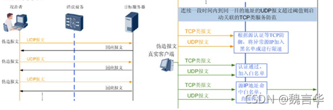

# DDOS攻击/防御介绍

**目录**

[1.防御流程图](#t0 "1.防御流程图")

[2.支持基于业务的精细化防护](#t1 "2.支持基于业务的精细化防护")

[3.引流方式](#t2 "3.引流方式")

[4.回注方式多样化](#t3 "4.回注方式多样化")

[4.1 MPLS VPN回注](#t4 "4.1 MPLS VPN回注")

[4.2 GRE tunnel回注](#t5 "4.2 GRE tunnel回注")

[4.3 二层回注](#t6 "4.3 二层回注")

[4.4 PBR(策略路由)回注](#t7 "4.4 PBR(策略路由)回注")

[5.典型应用场景](#t8 "5.典型应用场景")

[5.1.静态引流防护](#t9 "5.1.静态引流防护")

[5.2. 动态引流防护](#t10 "5.2. 动态引流防护")

[5.3. 逐包检测防护](#t11 "5.3. 逐包检测防护")

[6.攻击防范模式](#t12 "6.攻击防范模式")

[7\. 主要检测技术](#t13 "7. 主要检测技术")

[7.1. 静态阈值比较](#t14 "7.1. 静态阈值比较")

[7.2. 动态流量基线](#t15 "7.2. 动态流量基线")

[8\. 主要清洗技术介绍](#t16 "8. 主要清洗技术介绍")

[8.1 特征库过滤](#t17 "8.1 特征库过滤")

[8.1.1. IP信誉](#t18 "8.1.1. IP信誉")

[8.1.2 攻击特征库](#t19 "8.1.2 攻击特征库")

[8.2 静态过滤](#t20 "8.2 静态过滤")

[8.3 基于传输协议的源认证](#t21 "8.3 基于传输协议的源认证")

[8.4 基于应用协议的源认证](#t22 "8.4 基于应用协议的源认证")

[8.5 基于会话的攻击方案](#t23 "8.5 基于会话的攻击方案")

[8.6 行为分析技术](#t24 "8.6 行为分析技术")

[9 攻击防范介绍](#t25 "9 攻击防范介绍")

[9.1 DDOS通用攻击防范技术](#t26 "9.1 DDOS通用攻击防范技术")

[9.1.1 首包丢弃](#t27 "9.1.1 首包丢弃")

[9.1.2 阻断和限流](#t28 "9.1.2 阻断和限流")

[9.1.3 黑白名单](#t29 "9.1.3 黑白名单")

 [9.2 TCP类型报文攻击防范技术](#t30 " 9.2 TCP类型报文攻击防范技术")

[9.2.1 SYN flood攻击](#t31 "9.2.1 SYN flood攻击")

 [9.2.2 SYN-ACK flood攻击](#t32 " 9.2.2 SYN-ACK flood攻击")

[9.2.2 ACK flood攻击](#t33 "9.2.2 ACK flood攻击")

 [9.2.4 FIN/RST flood攻击](#t34 " 9.2.4 FIN/RST flood攻击")

[9.2.5 TCP链接耗尽攻击](#t35 "9.2.5 TCP链接耗尽攻击")

[9.2.6 TCP异常报文攻击](#t36 "9.2.6 TCP异常报文攻击 ") 

[9.3 UDP flood攻击](#t37 "9.3 UDP flood攻击 ") 

[9.3.1 UDP flood关联TCP类服务防范](#t38 "9.3.1 UDP flood关联TCP类服务防范")

 [9.3.2 载荷检查和指纹学习](#t39 " 9.3.2 载荷检查和指纹学习")

 [9.4 DNS类报文攻击](#t40 " 9.4 DNS类报文攻击")

[9.4.1 DNS报文交互过程](#t41 "9.4.1 DNS报文交互过程")

 [9.4.2 DNS攻击类型](#t42 " 9.4.2 DNS攻击类型")

[9.4.3 DNS request flood攻击](#t43 "9.4.3 DNS request flood攻击")

[9.4.4 异常DNS报文攻击](#t44 "9.4.4 异常DNS报文攻击")

[9.4.5 DNS reply flood攻击](#t45 "9.4.5 DNS reply flood攻击")

[9.4.6 未知域名攻击](#t46 "9.4.6 未知域名攻击 ") 

[9.4.7 DNS缓存投毒](#t47 "9.4.7 DNS缓存投毒")

 [9.5 HTTP/HTTPS flood 报文攻击防御](#t48 " 9.5 HTTP/HTTPS flood 报文攻击防御")

[9.5.1 HTTP flood攻击](#t49 "9.5.1 HTTP flood攻击")

[9.5.2 HTTP慢速攻击](#t50 "9.5.2 HTTP慢速攻击")

[10 DDOS防御系统部署方式](#t51 "10 DDOS防御系统部署方式")

[10.1 串行部署](#t52 "10.1 串行部署")

 [10.2 旁路单向引流部署](#t53 " 10.2 旁路单向引流部署")

 [10.3 旁路双向引流部署](#t54 " 10.3 旁路双向引流部署")

 [10.4 旁路动态引流部署](#t55 " 10.4 旁路动态引流部署")

* * *

1.防御流程图
-------

|   1   |   检测中心分析防护网络的分光或者镜像流量   |
| --- | --- |
|   2   |   检测中心发现流量异常，上报受攻击IP地址到管理中心   |
|   3   |   管理中心向清洗中心下发引流策略   |
|   4   |   通过BGP路由通告，清洗中心将被攻击IP的流量重定向到自身，实现流量牵引   |
|   5   |   清洗中心通过多层过滤的防御技术，丢弃攻击流量，转发正常流量   |
|   6   |   清洗中心回注正常业务流量到防护网络，回注方式包括：策略路由(PBR)、MPLS VPN、GRE tunnel、 L2等   |
|   7   |   清洗中心上报攻击日志到管理中心，管理中心服务清洗效果的呈现   |

2.支持基于业务的精细化防护
--------------

被防护对象可以是多个IP/掩码定义的IP段，为了实现对对外提供服务的服务器集群的精细化防护，针对每一个客户，系统还可以提供基于业务的防御策略配置，如果某个客户同时具有WEB和DNS服务，可以分别针对WEB业务和DNS业务配置防御策略。

可精细化的防护业务包括：HTTP、HTTPS、DNS、SIP等，可以通过4层+端口号来定义业务，每个防护对象可最多配置8种业务。

而且业务不仅可以手动配置，还可以检测模块自动学习获得，自动学习获得业务模型时，设备需要配置最低的业务流量，超过该阈值的流量才能作为业务，否则忽略该流量。

3.引流方式
------

(1) 静态引流：手工创建并下发引流策略到清洗设备引发引流，设备不会主动撤销引流。确保防护目标的流量实时经过清洗设备，用于静态防护。

(2) 动态引流：检测设备发现异常通告管理中心，管理中心自动生成引流策略并下发清洗设备，攻击结束后，管理中心下发取消引流策略到清洗设备

(3) 交互式引流：检测设备发现异常通告管理中心，管理中心自动生成引流策略，但需要经管理员手工确认后才能下发到清洗设备，攻击结束后，同样需要管理手工撤销引流策略。

4.回注方式多样化
---------

### 4.1 MPLS VPN回注

在DDOS清洗设备和R2上配置VPN，在回注链路上，DDOS清洗设备作为PE设备，R1作为P设备，R2为PE设备。清洗后的流量在DDOS清洗设备上被打上双层标签，经过R1后剥离外层标签，R2根据内层的私网标签查找相应的私网路由表对流量进行转发。

### 4.2 GRE tunnel回注

R2与DDOS清洗设备建立GRE tunnel，清洗后的流量经过GRE隧道到达R2.

### 4.3 二层回注

 

DDOS清洗设备上流量出接口的IP与防护对象属于同一个网段，清洗设备在处理完引流后，发送ARP request报文请求防护对象内目的IP的MAC地址，ARP reply会被清洗设备接收，从而将清洗后的正常流量通过SW1的二层交换回注到防护对象。

### 4.4 PBR(策略路由)回注

 

清洗设备将清洗后的流量会送到R1，R1接收到清洗后的流量后经过策略路由会送到R2.

5.典型应用场景
--------

### 5.1.静态引流防护

部署说明：

旁路静态引流部署模式，实时对指定流量进行防护，清洗设备可以动态学习网络流量模型，基于流量模型检测网络异常，对异常流量进行清洗，正常流量进行回注，并上报管理中心流量日志和攻击日志。管理中心负责设备的监控、管理、策略配置以及报表。

部署优势：

部署简单，成本低，适用于小型网络，对特定保护目标做深度，实时检测和清洗。几乎没有防护延时，保护效果好。

### 5.2. 动态引流防护

部署说明：

旁路部署Netflow检测设备，通过采样流量分析网络流量异常，发现攻击上报管理中心，由管理中心下发引流指令给清洗设备从而触发引流清洗。

部署优势：

大带宽网络部署低，适合城域网、IGW解决因大流量[DDOS攻击](https://so.csdn.net/so/search?q=DDOS%E6%94%BB%E5%87%BB&spm=1001.2101.3001.7020)引起的管道拥塞问题。

通常路由器对流量进行抽样统计(默认为1000：1抽样)形成抽样日志，所以无法检测小流量攻击，以及Netflow日志不具有应用层信息，所以Netflow方案不适合数据中心业务防护。

### 5.3. 逐包检测防护

部署说明：

旁路部署逐包检测设备，通过全流量分析网络异常，检测到流量异常上报管理中心，由管理中心下发引流策略给清洗中心，清洗中心发布引流路由将异常流量引入清洗设备进行清洗，正常流量进行回注，并上报管理中心流量日志和攻击日志。

部署优势：

全流量检测，适合小流量攻击、慢速攻击防御，且深入应用层内容分析攻击，防御精度高于Netflow检测，并且可以提供业务的精细化防护，适合业务防护场景。

6.攻击防范模式
--------

|   报文合法性检查   |   基于RFC检查报文合法性，过滤协议栈漏洞的畸形报文攻击   |
| --- | --- |
|   特征过滤   |   基于报文特征静态匹配过滤攻击，用于防御有特征的攻击，如UDP flood攻击，UDP类反射攻击   |
|   传输协议层源认证   |   用于防范虚假源发起的SYN flood   |
|   应用层源认证   |   用于防范虚假源活僵尸工具发起的DNS query flod，DNS reply flood，HTTP get/post flood   |
|   会话分析   |   基于会话检查防范类攻击，如 ACK flood、FIN/RST flood  TCP链接耗尽攻击，HTTP slow header/post 攻击   |
|   行为分析技术   |   僵尸网络发起的攻击流量和用户访问业务流量行为不同，用户访问流量具有突发性，访问资源较分散；而僵尸网络攻击最大的的特征是访问频率恒定，访问资源固定，所以可以基于行为分析CC攻击，慢速SYN flood攻击   |
|   流量整形   |   采用各类协议精细化限速使得达到服务器的流量处于服务器的安全带宽范围   |

7\. 主要检测技术
----------

### 7.1. 静态阈值比较

攻击检测的实质是检测设备对流量进行分类统计，然后和预先配置的阈值进行比较，如果超过阈值则认为流量发生异常，通知管理中心下发引流策略。所以攻击检测是否准确取决于阈值配置是否合理，而且合理性完全取决于管理人员的经验。不同的网络模型检测阈值配置没有统一的经验可循。

### 7.2. 动态流量基线

通过对用于网络的流量进行周期性的学习，取学习周期内每种流量模型的最大值作为基线值，结合容忍度(防止流量瞬间抖动防止误判)计算得来的值作为攻击检测阈值。用户网络流量模型发生变化，流量模型学习结果会自动发生调整，相应的阈值也会自动进行调整。

逐包检测系统支持60+流量模型学习，可以准确、秒级检测攻击：

5种统计维度：qps、pps、cps、bps、tcp ratio

8种协议族：IP、TCP、UDP、ICMP、HTTP、HTTPS、DNS、SIP。

38种协议状态：TCP flags、TCP connections、TCP windows size、HTTP connections、HTTP URI、HTTP host、DNS query、DNS domain等。

8\. 主要清洗技术介绍
------------

### 8.1 特征库过滤

#### 8.1.1. IP信誉

 系统支持两种IP信誉：全球僵尸网络IP信誉和本地业务访问IP信誉。

本地业务访问IP信誉是指系统在没有攻击时监控防护网络的TCP业务访问产生的会话，经过严格的认证后创建，当攻击发生时，直接作为白名单转发流量，确保防御不影响创建会话的业务访问，提升用户体验。

#### 8.1.2 攻击特征库

攻击特征库包含业界主流的攻击工具特征，包括：slowhttptest、slowloris、ApacheKill、ApacheBench等。

### 8.2 静态过滤

很多攻击报文具有明显的特征，系统提供简单易用的3/4/7层报文头部以及报文负载的特征过滤工具。

### 8.3 基于传输协议的源认证

基于传出协议的源认证核心思想是向源IP发送带有cookie的挑战认证报文，如果该源真实存在，则回应该挑战认证报文，且回应报文携带cookie。清洗中心通过校验cookie，即可以确认该源IP是否真实存在，改技术可以有效防御虚假源发起的SYN flood攻击。

### 8.4 基于应用协议的源认证

以HTTP flood攻击为例，清洗中心需要基于HTTP协议实施挑战认证以验证员是否真实存在，如果是，则建立白名单允许后续WEB流量通过。基于应用层的协议源认证技术可有效防范大多数僵尸网络工具发起的攻击。但有些先进的僵尸网络可以躲过基于应用层协议的源认证，比如有些僵尸网络利用http proxy发起攻击，或者直接实现浏览器的部分功能。对于该类攻击，清洗中心采用http高级源认证技术防范，即当攻击发生时，清洗中心会向源弹出要求输入校验码的认证页面，用户只要输入正确的校验码即可验证通过，继续访问。因校验码是随机变化的，可以有效防范大多数僵尸网络发起的攻击。

### 8.5 基于会话的攻击方案

通过会话监控即可及时发现那些会话属于异常会话，哪些源IP在不断的和服务器建立异常链接。会话监控可有效的防范TCP flood、空连接、重传攻击、ACK flood、FIN/RST floo、DNS投毒、HTTP slow header/post攻击。

### 8.6 行为分析技术

僵尸网络的攻击行为和正常用户的访问行为存在很大的差别，正常用户的访问具有突发性，访问资源比较分散，而僵尸网络属于机器人攻击，访问频率恒定，访问的资源保持不变，或者TCP流量比率异常，或者攻击报文负载不变，可以采用指纹学习或访问频率行为学习防范该类攻击。利用行为分析可以有效防范敷在具有特征的UDP flood、访问URL不变的HTTP get flood攻击。

9 攻击防范介绍
--------

七层防范体系：

### 9.1 DDOS通用攻击防范技术

#### 9.1.1 首包丢弃

有些攻击不断变化源IP地址和源端口号发送攻击报文，通过首包丢弃，可以有效拦截这部分流量。收包丢弃与源认证相结合，防止虚假源攻击。

                 收包丢弃加源认证处理流程

#### 9.1.2 阻断和限流

通过服务学习和经验发现网络中根本没有某种服务或某种服务流量很小，则可以分别采用阻断和限流的方法来进行防御攻击：

阻断：在定义服务策略中标识将匹配自定义服务的报文全部丢弃；在默认防御策略中表示将自定义服务以外的报文全部丢弃。

限流：在定义服务策略中，将匹配自定义服务的报文限定在一定的阈值内，丢弃超过阈值的部分。

#### 9.1.3 黑白名单

在防御过程中，通过源认证的合法源加入白名单，没有通过源认证的加入黑名单。

###  9.2 TCP类型报文攻击防范技术

TCP的报文的flood攻击类型：

1.  SYN flood
2.  SYN-ACK flood
3.  ACK flood
4.  FIN/RST flood
5.  TCP链接耗尽攻击
6.  TCP分片攻击
7.  TCP异常报文攻击

#### 9.2.1 SYN flood攻击

 利用TCP协议原理，针对TCP类flood攻击进行检测和防御，用于进行TCP链接，清洗设备回应经过构造的SYN-ACK报文，通过用户的反应来判断次用户是否正常。

对合法性源地址进行限速：

1.  源IP加入白名单之后将继续对真实源IP地址进行统计分析，对异常的源IP进行限速，以防止真实源发起攻击。
2.  TCP异常限速：基于源统计除ACK之外的其他报文总和(SYN+SYN-ACK+FIN/RST)与ACK报文的比例，当这个比例超过阈值时，判断源IP异常。

      3. 始终限速：任何情况下，都将除ACK外的其他报文的速率总和限制的阈值内。

####  9.2.2 SYN-ACK flood攻击

防御原理：

1.  清洗设备基于目的地址对SYN-ACK报文速率进行统计，当SYN-ACK报文速率超过阈值时，启动源认证防御。
2.  源认证成功者加入白名单，但是有失效时间。

#### 9.2.2 ACK flood攻击

 

当ACK报文超过速率阈值时，启动会话检查：

1.  如果清洗设备检查到ACK报文没有命中会话，通过严格模式和基本模式进行处理。
2.  如果清洗设备检查到ACK报文命中会话，则检查会话创建原因

严格模式：

1.  串行部署中建议采用严格模式
2.  如果ACK报文没有命中会话表，则DDOS设备直接丢弃ACK报文。
3.  如果ACK报文命中会话表，则允许ACK报文通过

基本模式：

1.  旁路部署中建议采用基本模式
2.  ACK报文没有命中会话表，DDOS设备允许第一个ACK报文通过，并建立会话表，然后对后续ACK报文进行会话检查，以确定是否允许后续同源IP发送的ACK报文是否通过。
3.  如果ACK报文命中会话表，则继续检查报文序列号，序号正确的允许通过，不正确的报文丢弃。 

####  9.2.4 FIN/RST flood攻击

 

防御原理：

1.  当FIN/RST报文速率超过阈值，则启动会话检查
2.  如果清洗设备检查到FIN/RST报文没有命中会话，则直接丢弃
3.  如果清洗设备检查到FIN/RST报文命中会话，则检查会话创建原因。 

#### 9.2.5 TCP链接耗尽攻击

链接耗尽攻击是指攻击者利用僵尸网络，向服务器发起大量的TCP链接，耗尽服务器的TCP链接资源。

链接耗尽一般有以下几种类型：

1.  完成三次握手后，不发送任何报文，一直维持这些TCP链接
2.  链接过程中呈现给服务端很小的TCP windows size，导致服务器TCP协议资源耗尽
3.  发送大量的TCP重传请求，以很小的流量即可导致被攻击网络上行链路拥塞

防御原理：

1.  源IP地址新建链接速率检查
2.  源IP地址并发链接数检查
3.  异常会话检查

*   3.1 空连接检查：如果在检查周期内，在某条TCP链接上通过的报文数小于阈值，则判定该链接为异常链接
*   3.2 重传会话检查：某条TCP链接上重传报文数量大于阈值时，则判定该链接为异常链接
*   3.3 慢启动链接检查：当某条TCP链接上通过的报文窗口小于阈值，则判断为异常链接

#### 9.2.6 TCP异常报文攻击 

攻击原理：TCP报文标志位包括URG，ACK，PSH，RST，SYN，FIN等六位，攻击者通过发送非法的TCP flag组合的报文，对主机造成伤害。

防御原理：

检查TCP报文的各个标志位，如果标志位异常，则认为是TCP异常报文。当TCP异常报文的速率大于告警阈值时，将所有TCP异常报文全部丢弃，并记录攻击日志。

(1)6个标志位全部为1

(2)6个标志位全部为0

(3)SYN和FIN同时为1

(4)SYN和RST同时为1

(5)FIN和RST同时为1

(6)带有载荷的SYN和SYN-ACK报文

### 9.3 UDP flood攻击  

攻击原理：攻击者通过僵尸网络向目标服务器发起大量的UDP报文，这种UDP报文通常为大包，且速率非常快。消耗网络带宽资源，造成链路拥塞大量变源端口的UDP flood会导致依靠会话转发的网络设备，性能降低甚至会话耗尽，从而导致网络瘫痪大量攻击报文到达服务器开放的UDP业务端口，服务器会检查报文的正确性，影响正常业务。

#### 9.3.1 UDP flood关联TCP类服务防范

当UDP流量与TCP类服务有关联时，通过防御TCP类服务来防御UDP flood。UDP是无连接的，是无法通过源认证的方式的防御UDP flood攻击，如果UDP业务需要TCP业务进行认证或者控制，则当UDP业务受到攻击时，对关联的TCP业务进行强制启动防御，用此TCP防御产生的白名单来决定同一源的UDP报文是丢弃还是转发

####  9.3.2 载荷检查和指纹学习

使用载荷检查和指纹学习的方法防御具有规律的UDP flood攻击

当攻击报文负载有特征时，可以采用动态的指纹学习和特征过滤来防御：

1.  载荷检查：当UDP流量超过阈值时，会触发载荷检查。如果UDP报文的数据字段全部都一样(例如数据段内容全部为1)，则认证是攻击报文而丢弃。
2.  指纹学习：当UDP流量超过阈值时，会触发指纹学习。指纹学习有DDOS设备动态学习生成，将攻击报文的一段显著特征学习为指纹后，匹配指纹的报文将被丢弃。 

 

###  9.4 DNS类报文攻击

#### 9.4.1 DNS报文交互过程

####  9.4.2 DNS攻击类型

(1)对缓存服务器攻击

(a)DNS request flood攻击

(b)DNS reply flood攻击

(c)未知域名攻击

(d)DNS缓存投毒攻击

(e)异常DNS报文攻击

(2)对授权服务器的攻击：

(a)DNS request攻击

(b)未知域名攻击

(c)异常DNS攻击

#### 9.4.3 DNS request flood攻击

可以针对DNS缓存和DNS授权服务进行攻击

DNS request flood攻击源可能是虚假源，也可能是真实源，针对不同类型的攻击源，采取的防御方式也不同

9.4.3.1 虚假源的防御：针对缓存服务器的攻击

DDOS设备基于目的地址对DNS request报文的速率进行统计，当DNS request报文的速率超过阈值时，则启动源认证检查。

基本模式：将每个源IP地址发送的首包丢弃，触发重新请求，然后对DNS重传报文进行域名检查，如果后续报文和首包请求的域名相同则源IP地址加入白名单。

增强模式：DDOS设备通过UDP转TCP实现DNS请求。

9.4.3.2 虚假源的防御：针对授权服务器

 

9.4.3.3 真实源的防御

如果是真源IP地址，经过上述防御后，通过的DNS报文的流量还是很大，则可以采取以下方式进行防御：

指定域名限速

源IP地址限速 

#### 9.4.4 异常DNS报文攻击

防御原理：报文检查

*   报文格式：对DNS报文格式进行检查，将非标准格式的DNS报文全部丢弃
*   报文长度：通常情况下，基于UDP协议的DNS报文长度小于512字节，超过512字节的都采用TCP协议。而现网中很多DNS flood攻击都采用超大的DNS报文以便造成链路拥塞，因此报文长度在防御DNS flood攻击时是个有效的手段，当DNS报文的长度超过一定的阈值后，DDOS设备将其直接丢弃
*   DNS报文的TTL值：尤其对DNS缓存服务器的防护，一搬都采用就近原则，所以DNS报文的TTL数值应该局限于一个范围内。当TTL超过阈值时，DDOS设备直接将其丢弃。

#### 9.4.5 DNS reply flood攻击

攻击原理： DNS reply flood攻击是指攻击者将大量伪造的DNS应答报文发送给某个DNS服务器主机，从而消耗服务器的处理性能。

DNS 反射攻击是指攻击者模拟被攻击目标向现网发送大量的DNS请求，导致攻击目标收到大量的DNS回应报文，导致所在链路拥塞。

#### 9.4.6 未知域名攻击 

攻击原理：攻击者向DNS服务器发送大量的不存在的域名请求：

DNS服务器在收到不存在的请求报文后，首先检查自身的缓存列表，发现域名不存在，则向上一级DNS服务器发送域名请求，只到跟服务器确认域名不存在，回应未知域名报文。

在未知域名攻击中，攻击者发送大量的伪造请求报文，导致缓存服务器和DNS授权服务器不断对不存在的域名进行查询，耗尽服务器性能，从而导致攻击目的。

防御原理：限速

当一秒内未知域名请求报文数与所有所有请求报文的比例超过阈值时，DDOS设备将向管理中心上报异常告警。

提取具体的未知域名，将其添加到“域名请求报文限速列表”，从而可以针对域名请求进行限速。

#### 9.4.7 DNS缓存投毒

 

###  9.5 HTTP/HTTPS flood 报文攻击防御

#### 9.5.1 HTTP flood攻击

攻击原理：攻击者通过代理或者僵尸网络发起大量的HTTP请求，请求选择数据库操作的URL或者其他消耗系统资源的URL，造成服务器资源耗尽，无法响应正常请求。

防御原理：

*   HTTP flood源认证
*   目的IP的URL检测
*   指纹学习

 9.5.1.1 源认证

源认证是防御HTTP flood攻击的最常用手段，这种防御适合客户端是浏览器的场景，因为浏览器支持完整的HTTP协议栈，可以正常回应重定向的报文或者验证码。

 

9.5.1.2 URL监测

URL检测是HTTP源认证防御的补充，当通过HTTP源认证的流量还超过阈值时，可以启用URL监测。

在指定的时间内，某个URL的访问流量超过一定的阈值后，DDOS设备启动针对源IP的URL监测，当某个IP地址对某个URL的访问数量超过总访问数量的一定比例后，则将该IP地址加入黑名单。

在配置URL监测时，可以将消耗内存或计算资源比较多，容易受攻击的URL加入“URL监测列表”。

9.5.1.3 HTTP源统计 

HTTP源统计是在基于目的IP流量异常的基础上，再启动针对源IP流量进行统计。

DDOS设备首先对到达目的IP的流量进行统计，当目的IP流量触发告警阈值时，再针对到达这个目的IP的每个源的流量进行统计，判断具体某个源流量异常，并对源IP的流量进行防御。

HTTP源统计功能可以更准确的定位异常源，并对异常源发出的流量进行防御。

#### 9.5.2 HTTP慢速攻击

HTTP慢速攻击是指利用现有HTTP合法机制，在建立了与HTTP服务器的链接后，尽量长时间保持该链接不释放，从而达到对HTTP服务器的攻击。

Slow post：攻击发送post报文向服务器请求提交数据，将总报文的长度设为一个很大的数值，但是随后的报文发送中，每次只发送很小的报文，这样导致服务器一直等待攻击发送数据。

Slow header：攻击者通过get或者post向服务器建立链接，但是HTTP头字段不发送结束符，之后发送其他字段进行报活，服务器一直等待头信息中的结束符而导致链接始终被占用。

防御原理：

DDOS对每秒的HTTP并发链接数进行监测，当超过一定的阈值时，会触发HTTP报文检查，检查下面的任意一种情况都认定为受到HTTP慢速攻击，则将该源IP地址判断为攻击源，加入黑名单中，同时断开该IP与服务器的HTTP链接。

*   连续多个HTTP post报文的总长度都很大，但其HTTP载荷的长度都很小。
*   连续多个HTTP get post的报文的报文头都没有结束符。

10 DDOS防御系统部署方式
---------------

### 10.1 串行部署

###  10.2 旁路单向引流部署

###  10.3 旁路双向引流部署

###  10.4 旁路动态引流部署

