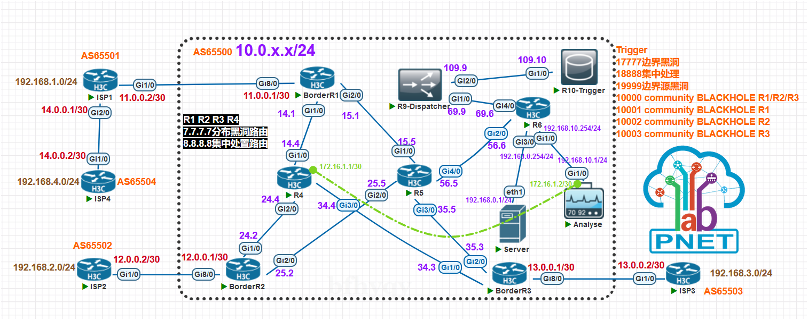
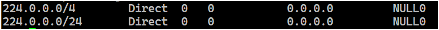
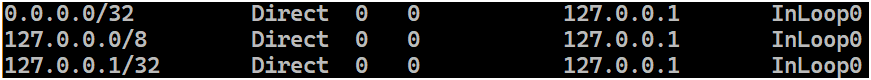
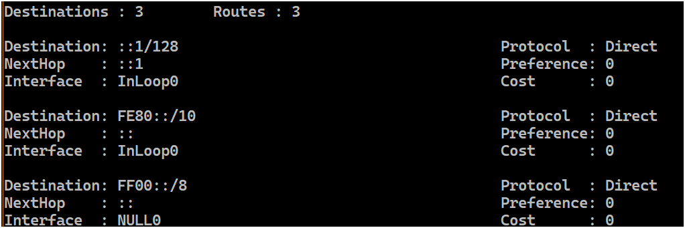
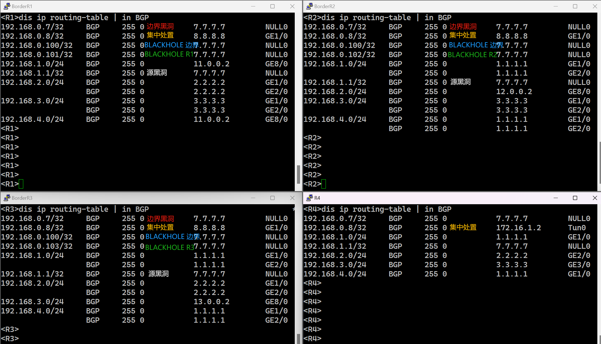
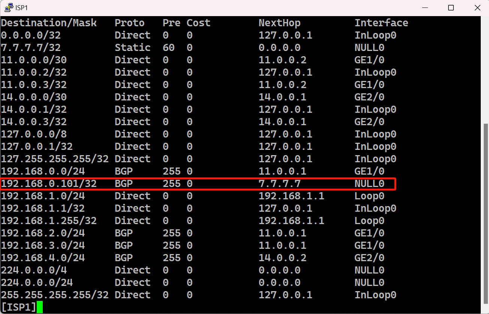

[Remote Triggered Black Hole](https://www.cnblogs.com/bfhyqy/p/18086538 "发布于 2024-04-17 22:50")
===============================================================================================

Remote Triggered Black Hole
===========================

*   [Remote Triggered Black Hole](#remote-triggered-black-hole)
    *   [基本原理](#%E5%9F%BA%E6%9C%AC%E5%8E%9F%E7%90%86)
    *   [目的黑洞](#%E7%9B%AE%E7%9A%84%E9%BB%91%E6%B4%9E)
        *   [边界黑洞](#%E8%BE%B9%E7%95%8C%E9%BB%91%E6%B4%9E)
        *   [基于位置黑洞](#%E5%9F%BA%E4%BA%8E%E4%BD%8D%E7%BD%AE%E9%BB%91%E6%B4%9E)
        *   [集中黑洞/隧道分析](#%E9%9B%86%E4%B8%AD%E9%BB%91%E6%B4%9E%E9%9A%A7%E9%81%93%E5%88%86%E6%9E%90)
    *   [源黑洞](#%E6%BA%90%E9%BB%91%E6%B4%9E)
    *   [BGP BLACKHOLE community](#bgp-blackhole-community)
    *   [RFC6666](#rfc6666)
    *   [效果](#%E6%95%88%E6%9E%9C)
    *   [Flowspec](#flowspec)
    *   [完整配置](#%E5%AE%8C%E6%95%B4%E9%85%8D%E7%BD%AE)
    *   [参考](#%E5%8F%82%E8%80%83)

基本原理
----

首先说明一下 RTBH (Remote Triggered Black Hole 远程触发黑洞路由) 是一个相对古早的技术，其主要目的是集中的控制某一个地址或地址段的路由，多用于在公网上缓解DoS攻击。

虽说 RTBH 也经历了一些发展（rfc3882、rfc5635、rfc7999）但仍然是一种基于三层IP地址的控制技术，在控制能力和灵活性上能力一般，由于主要是基于 BGP next-hop 属性做控制，所以操作上相对繁琐控制颗粒度也较粗;

RTBH 的技术原理其实很简单，使用 BGP 协议在 AS 内发布目标地址或地址段的 next-hop ，使其指向预先定义的黑洞路由；也可以使用路由策略针对不同的路由器设置不同的 next-hop，从而实现 “Romote Trigger”。

一般来讲，路由器的转发能力要大于其过滤能力，况且 acl/QoS、PBR 等要想是实现自动远程配置几乎只能使用专门开发的系统或设备（通过BGP传递Qos其实有相关的公有技术--[“QPPB”](https://www.cnblogs.com/bfhyqy/p/18166979)，不过用的不多）,所以 RTBH 对比其他技术还是有一些价值的。

> 如果希望有更好的通用控制能力 [Flowspec](https://www.cnblogs.com/bfhyqy/p/18133178) 是一个更好的选择，但这是一个相对较新的技术，低端和老旧设备不一定支持，现阶段部署 RTBH 还有一定的价值；[Flowspec](https://www.cnblogs.com/bfhyqy/p/18133178) 可以看作是使用 MP-BGP 传递的 acl/pbr/QoS，后面[单独成文](https://www.cnblogs.com/bfhyqy/p/18133178)。

下面使用模拟器演示传统 RTBH ，拓扑和各 IP 地址如图所示，图中模拟了公网环境 AS65500 和三个 AS 互联；

*   AS 之间使用 EBGP；AS6500 内使用 IS-IS 作为 IGP ；
*   R1 R2 R3 作为边界路由器各连接一个 ISP/AS；
*   服务器地址是 192.168.0.1/24 模拟DoS中的受害者；
*   R10 生成 RTBH 目标网段；
*   R9 作为分发者将策略下发至各执行路由器；
*   R4 作为集中处置路由器，可以执行黑洞或者将流量通过隧道传送给分析器；
*   R5 R6 是正常转发路由不执行特殊路由策略；
*   拓扑中除 Server 为 linux 外其余设备均为 H3C-vSR1000 Version 7.1.064, Release 1362P12；环境为网络演示，分析器 Analyse 仅终结了隧道并未做后续处理；
*   演示传统 RTBH，不作为最佳实践；



**策略方式：**  
R10-Trigger 基于静态路由tag分类不同引入 BGP 后携带不同的 Community 发给R9；  
R9 基于不同类型的 community 通过 route-policy 设置不同种类的 RTBH ；

为减少篇幅，通用配置见最后的[完整配置](#%E5%AE%8C%E6%95%B4%E9%85%8D%E7%BD%AE)章节。

> 我在查文档的时候，RTBH 基本都是基于 cisco 或者juniper 设备的配置，其中路由的生成和策略的分发是在同一台设备上完成的，即 R9 和 R10 的功能在同一台设备上实现，本例中没有这么做是因为[华为](https://support.huawei.com/enterprise/zh/doc/EDOC1100127028/2d6f2ec7)和[H3C](https://www.h3c.com/cn/d_202107/1427528_30005_0.htm#_Toc76491127)的设备明确指出 BGP 路由的“原始产生位置”不支持使用 route-policy 手动更改 “next-hop” ；即：在 BGP 视图下使用 “network” 和 “import” 命令的时候使用 route-policy 修改 “next-hop” 不生效，所以才有这种“路由产生”和“策略分发”分离的方式。

目的黑洞
----

Anti DoS 场景，目的黑洞就是把受害者的地址加到黑洞路由；但这样的话目的地址就彻底失联了，反而算是主动 DoS 了，失去了防护意义，这种情况就需要选择性的使部分路由器产生黑洞路由；

### 边界黑洞

AS 边界路由器是执行`目的黑洞`的良好位置，对于公网设备来说，更早的处理攻击流量可以有效的降低 AS 内部的网络压力；大流量DoS攻击，不仅会对目的服务器会产生重大打击，对网络基础设施也会有明显影响。

配置示例：

```csharp
####R10####
#基于 tag 分类，此处将 tag 17777 的静态路由标记 community 1:7777 传递给 R9
route-policy classer permit node 10
 if-match tag 17777
 apply community 1:7777
#
#本配置中 tag 17777 代表目的黑洞
 ip route-static 192.168.0.7 32 NULL0 tag 17777
```

```cmake
#
####R9####
bgp 65500
  #~常规配置略，详见“完整配置”章节~
 address-family ipv4 unicast
  #~常规配置略，详见“完整配置”章节~
  peer Border route-policy Border_Policy export
  peer Border advertise-community
  peer Inner route-policy Inner_Policy export
  
  #入向分类，基于 R10 传递的 Community 分类
  peer Trigger route-policy classifier import
#
#出向策略，发送给边界路由器时候的路由策略
#第一条为常规 BGP 路由，不是 RTBH 路由
route-policy Border_Policy permit node 1
 if-match tag 0
# RTBH 路由 ， 7.7.7.7 为预先定义的黑洞
route-policy Border_Policy permit node 10
 if-match tag 17777
 apply community no-export
 apply ip-address next-hop 7.7.7.7
#
#内网常规路由器 BGP 路由
route-policy Inner_Policy permit node 10
 if-match tag 0
 
#入向策略，Trigger路由分类
route-policy classifier permit node 10
 if-match community name com17777
 apply tag 17777
route-policy classifier deny node 80
#
#community-list 用于匹配 community
 ip community-list basic com17777 permit 1:7777
```

```x86asm
####R1/R2/R3####
bgp 部分略
ip route-static 7.7.7.7 32 NULL0
```

### 基于位置黑洞

只在某一个边界路由器上设置黑洞可以减少 RTBH 对正常流量的影响；  
为每个边界路由器设置单独的 route-policy ，除了有点麻烦没什么问题；  
不过对于此种需求一般建议使用 BLACKHOLE Community 方式从边界路由器再进行一次过滤，减少了集中配置的策略数量。详见下面的 [BGP BLACKHOLE community](#bgp-blackhole-community) 章节。

### 集中黑洞/隧道分析

边界路由器是执行黑洞路由的优选位置，但有时候需要对异常流程进行集中处理（比如分析等）, R4 作为集中处置路由器，可以执行黑洞或者将流量通过隧道传送给分析器。

将目标地址在边界的下一跳指向 R4 ，R4的的下一跳指向隧道发送给分析器：

```cmake
#
bgp 65500
  #~常规配置略，详见“完整配置”章节~
 #
 address-family ipv4 unicast
  #~常规配置略，详见“完整配置”章节~
  peer Border route-policy Border_Policy export
  peer Border advertise-community
  peer Centralization route-policy Centralization_Policy export
  peer Trigger route-policy classifier import
#
#边界出向常规 BGP 路由
route-policy Border_Policy permit node 1
 if-match tag 0
#边界出向集中处置路由
route-policy Border_Policy permit node 20
 if-match tag 18888
 apply community no-export
 apply ip-address next-hop 8.8.8.8
#

#基础处置路由，出向策略
#R4 常规路由
route-policy Centralization_Policy permit node 1
 if-match tag 0
#集中处置路由
route-policy Centralization_Policy permit node 20
 if-match tag 18888
 apply ip-address next-hop 172.16.1.2
#入向分类
route-policy classifier permit node 20
 if-match community name com18888
 apply tag 18888
#
route-policy classifier deny node 80
#
ip community-list basic com18888 permit 1:8888
```

源黑洞
---

BGP 是一个路由信息传递协议，而路由的传递基于目的地址，目前还没有哪种路由协议会涉及源地址；

但考虑一下，DoS/DDoS 攻击过程中封禁源地址比目的地址更有意义；封禁目的地址，会导致受害者彻底失联，即使只在特定 AS 入口封禁也会有大量的合法访问被波及而无法访问服务；

网路通信是双向的，源地址在回包时候就是目的地址，所以简单的把 DoS 攻击源地址加入黑洞也是有一定意义的，但对于大部分的泛洪攻击流量就没什么效果，这类攻击基本都是源地址发起大量流量，对受害服务器的回包不关心；

路由黑洞只对目的生效，但结合[uRPF](https://www.cnblogs.com/bfhyqy/p/18125848)技术可以很好解决源黑洞问题；简单来讲，开启[uRPF](https://www.cnblogs.com/bfhyqy/p/18125848)后，源、目任一方不在路由表中就拒绝转发；这样对攻击源设置为黑洞就变相实现源黑洞效果；urpf 配置也方式十分简单：

```x86asm
#R1/R2/R3边界路由器
ip urpf loose
```

R9 设置和目的黑洞一样无差别:

```cmake
bgp 65500
  #~常规配置略，详见“完整配置”章节~
 #
 address-family ipv4 unicast
  #~常规配置略，详见“完整配置”章节~
  peer Border route-policy Border_Policy export
  peer Border advertise-community
  peer Inner route-policy Inner_Policy export
  #设置入向分类
  peer Trigger route-policy classifier import
#
route-policy Border_Policy permit node 1
 if-match tag 0
#
route-policy Border_Policy permit node 30
 if-match tag 19999
 apply community no-export
 apply ip-address next-hop 7.7.7.7
#
route-policy Centralization_Policy permit node 1
 if-match tag 0
#
route-policy Centralization_Policy permit node 30
 if-match tag 19999
 apply ip-address next-hop 7.7.7.7
#
route-policy classifier permit node 30
 if-match community name com19999
 apply tag 19999
#
route-policy classifier deny node 80
#
ip community-list basic com19999 permit 1:9999
```

> uRPF 功能有不同模式(strict/loose)，各有适用场景，详细一点的解释可以看[这里](https://www.cnblogs.com/bfhyqy/p/18125848)。

BGP BLACKHOLE community
-----------------------

上述的黑洞方式在跨 AS 的情况下会变得没这么有效，由于不同 AS 通常不是由同一批管理人员控制，next-hop 方式黑洞方式需要预先定义个静态黑洞路由，一个 AS 的路由器解释为黑洞的地址在另一个 AS 内可能正常转发（虽说公网上通常将 rfc1918等定义的定制指向黑洞，但这也只是对对方合理的假设并不是一定要执行的）；其实还有一个问题就是 AS 边界路由器出于网络设备压力考虑，通常会拒绝过于明细的 BGP 路由（比如前缀大于 /24 的 IPv4 和大于 /48 的IPv6路由，[rfc7454](https://www.rfc-editor.org/rfc/rfc7454#section-6.1.3)），但 RTBH 最常用设置的就是32位(IPv4，v6为128为)地址，很少会封禁一整个网段；

这时要么在 BGP 中再定义一个新的行为来执行黑洞操作，要么定义一个公认的黑洞地址；目前这两种方案均有 RFC ，[rfc7999](https://www.rfc-editor.org/rfc/rfc7999.html) 定义了黑洞 Community(0xFFFF029A) ，[rfc6666](https://www.rfc-editor.org/rfc/rfc6666.html) 定义了黑洞地址；不过 rfc6666 仅定义了公认 IPv6 黑洞地址（0100::/64），IPv4没有。

rfc7999 的意义其实不在于定义了一个新的 BGP 行为，而是定义了一个`公认`的行为，毕竟只要与另外一个 AS 约定好，任意私有 Community 均可充当 BLACKHOLE；现在的路由器默认不执行 BLACKHOLE 行为，甚至都不能识别 BLACKHOLE 为一个well-known community，下面以手动 route-policy 的方式实现：

```powershell
#
bgp 65500
  #~常规配置略，详见“完整配置”章节~
 #
 address-family ipv4 unicast
  peer Border route-policy Border_Policy export
  peer Inner route-policy Inner_Policy export
  peer Trigger route-policy classifier import
#
route-policy Border_Policy permit node 1
 if-match tag 0
#
# BLACKHOLE Community 0xFFFF029A 十进制为 4294902426
route-policy Border_Policy permit node 40
 if-match tag 10000
 apply community 1:0 4294902426
 apply ip-address next-hop 7.7.7.7
#
route-policy Border_Policy permit node 50
 if-match tag 10001
 apply community 1:1 4294902426
 apply ip-address next-hop 7.7.7.7
#
route-policy Border_Policy permit node 60
 if-match tag 10002
 apply community 1:2 4294902426
 apply ip-address next-hop 7.7.7.7
#
route-policy Border_Policy permit node 70
 if-match tag 10003
 apply community 1:3 4294902426
 apply ip-address next-hop 7.7.7.7
#
route-policy Inner_Policy permit node 10
 if-match tag 0
#
route-policy classifier permit node 40
 if-match community name com10000
 apply tag 10000
#
route-policy classifier permit node 50
 if-match community name com10001
 apply tag 10001
#
route-policy classifier permit node 60
 if-match community name com10002
 apply tag 10002
#
route-policy classifier permit node 70
 if-match community name com10003
 apply tag 10003
#
route-policy classifier deny node 80
#
 ip community-list basic com10000 permit 1:0
 ip community-list basic com10001 permit 1:1
 ip community-list basic com10002 permit 1:2
 ip community-list basic com10003 permit 1:3
```

```perl
#边界路由以R1为例

bgp 65500
 router-id 1.1.1.1
 group RR internal
 peer RR connect-interface LoopBack0
 peer 10.0.69.9 group RR
 peer 11.0.0.2 as-number 65501
 peer 11.0.0.2 connect-interface GigabitEthernet8/0
 #
 address-family ipv4 unicast
  peer RR enable
  peer RR route-policy BLACKHOLE_COMMUNITY import
  peer RR next-hop-local
  peer 11.0.0.2 enable
  peer 11.0.0.2 advertise-community
  peer 11.0.0.2 next-hop-local
#
#未设置no-export，表明此路由需要传递给ebgp对等体，请对端协助处置目的黑洞
route-policy BLACKHOLE_COMMUNITY permit node 10
 if-match community name blackhole_r1
 apply community 4294902426
 apply ip-address next-hop 7.7.7.7
#
route-policy BLACKHOLE_COMMUNITY permit node 20
 if-match community name blackhole_all
 apply community 4294902426 no-export
 apply ip-address next-hop 7.7.7.7
#
route-policy BLACKHOLE_COMMUNITY deny node 30
 if-match community name blackhole_comm
#
route-policy BLACKHOLE_COMMUNITY permit node 40
#
 ip community-list basic blackhole_all permit 1:0 4294902426
 ip community-list basic blackhole_comm permit 4294902426
 ip community-list basic blackhole_r1 permit 1:1 4294902426
```

假设攻击源位于 AS65504，AS65500 向 AS65001发送BLACKHOLE community，请 AS65501 协助封禁经过 AS65501 发往 AS65500 的某一地址的流量。

```perl
##ISP1
bgp 65501
 router-id 192.168.1.0
 peer 11.0.0.1 as-number 65500
 peer 11.0.0.1 connect-interface GigabitEthernet1/0
 peer 14.0.0.2 as-number 65504
 peer 14.0.0.2 connect-interface GigabitEthernet2/0
 #
 address-family ipv4 unicast
  network 192.168.1.0 255.255.255.0
  peer 11.0.0.1 enable
  peer 11.0.0.1 route-policy blackhole_comm import
  peer 11.0.0.1 next-hop-local
  peer 14.0.0.2 enable
  peer 14.0.0.2 next-hop-local
#
#接受目的黑洞BLACKHOLE，设置 no-export 不再跨 AS 传播
route-policy blackhole_comm permit node 10
 if-match community name blackhole
 apply community no-export
 apply ip-address next-hop 7.7.7.7
#
route-policy blackhole_comm permit node 100
#
 ip community-list basic blackhole permit 4294902426
#
```

RFC6666
-------

这个 RFC 废除了一个 IPv6 地址段的前缀，专门用于 IPv6 的黑洞路由，本 RFC 篇幅不长可以直接读一下，之前这个[文章](https://www.cnblogs.com/bfhyqy/p/18079197)也简单描述了一下此 RFC 的目的。

前面已经说过 BGP 协议无法把 next-hop = NULL0 这种形式的路由传递出去，RTBH 需要预先定义一个指向NULL的黑洞路由（比如前面例子中的7.7.7.7），再使用 BGP 传递 next-hop = 7.7.7.7 从而将目标路由间接指向 NULL。

> 上面拓扑示例中为了方便，使用了容易记忆的 7.7.7.7 作为黑洞，在实际使用的过程中一般使用网络中不会出现的地址，如在公网中使用 RFC1918 地址作为黑洞，或者使用 RFC5737 中定义的 TEST-NET 地址，192.0.2.0/24、198.51.100.0/24 等。

此 RFC 废除的地址段被专门用于黑洞路由，现在路由器还没默认执行该 RFC，需要手动添加路由表，如果打算实现 IPv6 的 RTBH 非常建议直接使用这个段；

如果路由器执行该 RFC，这个前缀应该会被默认添加进路由表，地位类似下面展示的其他指向NULL的特殊用途路由或指向的自身的本地路由：  
  
  


效果
--

```csharp
####R10-Trigger####
#边界目的黑洞
 ip route-static 192.168.0.7 32 NULL0 tag 17777
#集中处置
 ip route-static 192.168.0.8 32 NULL0 tag 18888
#全体边界 BLACKHOLE
 ip route-static 192.168.0.100 32 NULL0 tag 10000
#R1 BLACKHOLE
 ip route-static 192.168.0.101 32 NULL0 tag 10001
#R2 BLACKHOLE
 ip route-static 192.168.0.102 32 NULL0 tag 10002
#R3 BLACKHOLE
 ip route-static 192.168.0.103 32 NULL0 tag 10003
#边界源黑洞
 ip route-static 192.168.1.1 32 NULL0 tag 19999
```

**边界黑洞和集中处置路由**  


**R1 BLACKHOLE传递给ISP1的黑洞路由**  


Flowspec
--------

前面说到了传统的 RTBH 是一种粒度很粗的控制方式，而且完全依赖 route-policy 设置 next-hop 实现；可以说灵活度和控制能力都比较有限，好在并没有引入新的协议和特性，完全沿袭之前的技术，使用合理的组合实现 RTBH，几乎无需对设备进行升级，对设备性能也没有很高的需求。

但是随着网络技术的发展对 RTBH 技术有了新的要求，Flowspec 作为一种专门处理网络中非法异常流量的控制协议，作为 MP-BGP 一个新的地址族被加入 ，其角色和架构和上述的 RTBH 差不多，主要是标准协议化了，有更好的控制颗粒度和更灵活的控制方式。这里限于篇幅此部分内容单独成文，具体见[这里](https://www.cnblogs.com/bfhyqy/p/18133178)。

完整配置
----

策略写的有点乱，一般情况下不会同时部署所有类型的 RTBH；简单测试功能正常，没详细测试不知道有没有逻辑bug，抛砖引玉；

```powershell
###R9
interface LoopBack0
 ip address 9.9.9.9 255.255.255.255
#
interface GigabitEthernet1/0
 port link-mode route
 ip address 10.0.69.9 255.255.255.0
#
interface GigabitEthernet2/0
 port link-mode route
 ip address 10.0.109.9 255.255.255.0
#
bgp 65500
 router-id 9.9.9.9
 group Border internal
 peer Border connect-interface GigabitEthernet1/0
 group Centralization internal
 peer Centralization connect-interface GigabitEthernet1/0
 group Inner internal
 peer Inner connect-interface GigabitEthernet1/0
 group Trigger internal
 peer Trigger connect-interface GigabitEthernet2/0
 peer 1.1.1.1 group Border
 peer 2.2.2.2 group Border
 peer 3.3.3.3 group Border
 peer 4.4.4.4 group Centralization
 peer 5.5.5.5 group Inner
 peer 6.6.6.6 group Inner
 peer 10.0.109.10 group Trigger
 #
 address-family ipv4 unicast
  #出向可以被route-policy修改
  reflect change-path-attribute

  #BGP路由不加入本地路由表，减轻R9作为控制器的压力
  routing-table bgp-rib-only

  peer Border enable
  peer Border route-policy Border_Policy export
  peer Border advertise-community
  peer Border reflect-client
  peer Centralization enable
  peer Centralization route-policy Centralization_Policy export
  peer Centralization reflect-client
  peer Inner enable
  peer Inner route-policy Inner_Policy export
  peer Inner reflect-client
  peer Trigger enable
  peer Trigger route-policy classifier import
#
route-policy Border_Policy permit node 1
 if-match tag 0
#
route-policy Border_Policy permit node 10
 if-match tag 17777
 apply community no-export
 apply ip-address next-hop 7.7.7.7
#
route-policy Border_Policy permit node 20
 if-match tag 18888
 apply community no-export
 apply ip-address next-hop 8.8.8.8
#
route-policy Border_Policy permit node 30
 if-match tag 19999
 apply community no-export
 apply ip-address next-hop 7.7.7.7
#
route-policy Border_Policy permit node 40
 if-match tag 10000
 apply community 1:0 4294902426
 apply ip-address next-hop 7.7.7.7
#
route-policy Border_Policy permit node 50
 if-match tag 10001
 apply community 1:1 4294902426
 apply ip-address next-hop 7.7.7.7
#
route-policy Border_Policy permit node 60
 if-match tag 10002
 apply community 1:2 4294902426
 apply ip-address next-hop 7.7.7.7
#
route-policy Border_Policy permit node 70
 if-match tag 10003
 apply community 1:3 4294902426
 apply ip-address next-hop 7.7.7.7
#
route-policy Centralization_Policy permit node 1
 if-match tag 0
#
route-policy Centralization_Policy permit node 10
 if-match tag 17777
 apply ip-address next-hop 7.7.7.7
#
route-policy Centralization_Policy permit node 20
 if-match tag 18888
 apply ip-address next-hop 172.16.1.2
#
route-policy Centralization_Policy permit node 30
 if-match tag 19999
 apply ip-address next-hop 7.7.7.7
#
route-policy Inner_Policy permit node 10
 if-match tag 0
#
route-policy classifier permit node 10
 if-match community name com17777
 apply tag 17777
#
route-policy classifier permit node 20
 if-match community name com18888
 apply tag 18888
#
route-policy classifier permit node 30
 if-match community name com19999
 apply tag 19999
#
route-policy classifier permit node 40
 if-match community name com10000
 apply tag 10000
#
route-policy classifier permit node 50
 if-match community name com10001
 apply tag 10001
#
route-policy classifier permit node 60
 if-match community name com10002
 apply tag 10002
#
route-policy classifier permit node 70
 if-match community name com10003
 apply tag 10003
#
route-policy classifier deny node 80
#
 ip community-list basic com10000 permit 1:0
 ip community-list basic com10001 permit 1:1
 ip community-list basic com10002 permit 1:2
 ip community-list basic com10003 permit 1:3
 ip community-list basic com17777 permit 1:7777
 ip community-list basic com18888 permit 1:8888
 ip community-list basic com19999 permit 1:9999
#
#此处静态的作用：
#BGP作为一个路由协议在传递路由之前会与当前路由表比对
#只有本地有效的路由条目才会被传递出去
#R9作为控制器其实无需获取过多路由条目，仅需要和BGP对等体通信即可
#但路由在本地无效不会传递，所以添加如下路由
#下面路由也可以使用一条指向10.0.69.6默认路由替代
#此处不想R9与无关地址通信，所以做了如下路由条目
 ip route-static 0.0.0.0 0 NULL0
 ip route-static 1.1.1.1 32 10.0.69.6
 ip route-static 2.2.2.2 32 10.0.69.6
 ip route-static 3.3.3.3 32 10.0.69.6
 ip route-static 4.4.4.4 32 10.0.69.6
 ip route-static 5.5.5.5 32 10.0.69.6
 ip route-static 6.6.6.6 32 10.0.69.6
```

```powershell
###R10
interface LoopBack0
 ip address 10.10.10.10 255.255.255.255
#
interface GigabitEthernet1/0
 port link-mode route
 ip address 10.0.109.10 255.255.255.0
#
bgp 65500
 router-id 10.10.10.10
 group RR internal
 peer RR connect-interface GigabitEthernet1/0
 peer 9.9.9.9 as-number 65500
 peer 9.9.9.9 connect-interface GigabitEthernet1/0
 peer 10.0.109.9 group RR
 #
 address-family ipv4 unicast
  import-route static route-policy classer
  peer RR enable
  peer RR advertise-community
#
route-policy classer permit node 10
 if-match tag 17777
 apply community 1:7777
#
route-policy classer permit node 20
 if-match tag 18888
 apply community 1:8888
#
route-policy classer permit node 30
 if-match tag 19999
 apply community 1:9999
#
route-policy classer permit node 40
 if-match tag 10000
 apply community 1:0
#
route-policy classer permit node 50
 if-match tag 10001
 apply community 1:1
#
route-policy classer permit node 60
 if-match tag 10002
 apply community 1:2
#
route-policy classer permit node 70
 if-match tag 10003
 apply community 1:3
#
 ip route-static 192.168.0.7 32 NULL0 tag 17777
 ip route-static 192.168.0.8 32 NULL0 tag 18888
 ip route-static 192.168.0.100 32 NULL0 tag 10000
 ip route-static 192.168.0.101 32 NULL0 tag 10001
 ip route-static 192.168.0.102 32 NULL0 tag 10002
 ip route-static 192.168.0.103 32 NULL0 tag 10003
 ip route-static 192.168.1.1 32 NULL0 tag 19999
```

```perl
###R1
isis 1
 is-level level-1
 cost-style wide
 network-entity 65.0000.0010.0100.1001.00
#
 ip urpf loose
#
interface LoopBack0
 ip address 1.1.1.1 255.255.255.255
 isis enable 1
#
interface GigabitEthernet1/0
 port link-mode route
 ip address 10.0.14.1 255.255.255.0
 isis enable 1
#
interface GigabitEthernet2/0
 port link-mode route
 ip address 10.0.15.1 255.255.255.0
 isis enable 1
#
interface GigabitEthernet8/0
 port link-mode route
 ip address 11.0.0.1 255.255.255.252
#
bgp 65500
 router-id 1.1.1.1
 group RR internal
 peer RR connect-interface LoopBack0
 peer 10.0.69.9 group RR
 peer 11.0.0.2 as-number 65501
 peer 11.0.0.2 connect-interface GigabitEthernet8/0
 #
 address-family ipv4 unicast
  peer RR enable
  peer RR route-policy BLACKHOLE_COMMUNITY import
  peer RR next-hop-local
  peer 11.0.0.2 enable
  peer 11.0.0.2 advertise-community
  peer 11.0.0.2 next-hop-local
#
route-policy BLACKHOLE_COMMUNITY permit node 10
 if-match community name blackhole_r1
 apply community 4294902426
 apply ip-address next-hop 7.7.7.7
#
route-policy BLACKHOLE_COMMUNITY permit node 20
 if-match community name blackhole_all
 apply community 4294902426 no-export
 apply ip-address next-hop 7.7.7.7
#
route-policy BLACKHOLE_COMMUNITY deny node 30
 if-match community name blackhole_comm
#
route-policy BLACKHOLE_COMMUNITY permit node 40
#
 ip community-list basic blackhole_all permit 1:0 4294902426
 ip community-list basic blackhole_comm permit 4294902426
 ip community-list basic blackhole_r1 permit 1:1 4294902426
#
 ip route-static 7.7.7.7 32 NULL0

```

```perl
###R2
isis 1
 is-level level-1
 cost-style wide
 network-entity 65.0000.0020.0200.2002.00
#
 ip urpf loose
#
interface LoopBack0
 ip address 2.2.2.2 255.255.255.255
 isis enable 1
#
interface GigabitEthernet1/0
 port link-mode route
 ip address 10.0.24.2 255.255.255.0
 isis enable 1
#
interface GigabitEthernet2/0
 port link-mode route
 ip address 10.0.25.2 255.255.255.0
 isis enable 1
#
interface GigabitEthernet8/0
 port link-mode route
 ip address 12.0.0.1 255.255.255.252
#
bgp 65500
 router-id 2.2.2.2
 group RR internal
 peer RR connect-interface LoopBack0
 peer 10.0.69.9 group RR
 peer 12.0.0.2 as-number 65502
 peer 12.0.0.2 connect-interface GigabitEthernet8/0
 #
 address-family ipv4 unicast
  peer RR enable
  peer RR route-policy BLACKHOLE_COMMUNITY import
  peer RR next-hop-local
  peer 12.0.0.2 enable
  peer 12.0.0.2 next-hop-local
#
route-policy BLACKHOLE_COMMUNITY permit node 10
 if-match community name blackhole_r2
 apply community 4294902426
 apply ip-address next-hop 7.7.7.7
#
route-policy BLACKHOLE_COMMUNITY permit node 20
 if-match community name blackhole_all
 apply community 4294902426 no-export
 apply ip-address next-hop 7.7.7.7
#
route-policy BLACKHOLE_COMMUNITY deny node 30
 if-match community name blackhole_comm
#
route-policy BLACKHOLE_COMMUNITY permit node 40
#
 ip community-list basic blackhole_all permit 1:0 4294902426
 ip community-list basic blackhole_comm permit 4294902426
 ip community-list basic blackhole_r2 permit 1:2 4294902426
#
 ip route-static 7.7.7.7 32 NULL0

```

```perl
###R3
isis 1
 is-level level-1
 cost-style wide
 network-entity 65.0000.0030.0300.3003.00
#
 ip urpf loose
#
interface LoopBack0
 ip address 3.3.3.3 255.255.255.255
 isis enable 1
#
interface GigabitEthernet1/0
 port link-mode route
 ip address 10.0.34.3 255.255.255.0
 isis enable 1
#
interface GigabitEthernet8/0
 port link-mode route
 ip address 13.0.0.1 255.255.255.252
#
bgp 65500
 router-id 3.3.3.3
 group RR internal
 peer RR connect-interface LoopBack0
 peer 10.0.69.9 group RR
 peer 13.0.0.2 as-number 65503
 peer 13.0.0.2 connect-interface GigabitEthernet8/0
 #
 address-family ipv4 unicast
  peer RR enable
  peer RR route-policy BLACKHOLE_COMMUNITY import
  peer RR next-hop-local
  peer 13.0.0.2 enable
  peer 13.0.0.2 next-hop-local
 #
#
route-policy BLACKHOLE_COMMUNITY permit node 10
 if-match community name blackhole_r3
 apply community 4294902426
 apply ip-address next-hop 7.7.7.7
#
route-policy BLACKHOLE_COMMUNITY permit node 20
 if-match community name blackhole_all
 apply community 4294902426 no-export
 apply ip-address next-hop 7.7.7.7
#
route-policy BLACKHOLE_COMMUNITY deny node 30
 if-match community name blackhole_comm
#
route-policy BLACKHOLE_COMMUNITY permit node 40
#
 ip community-list basic blackhole_all permit 1:0 4294902426
 ip community-list basic blackhole_comm permit 4294902426
 ip community-list basic blackhole_r3 permit 1:3 4294902426
#
 ip route-static 7.7.7.7 32 NULL0

```

```bash
###R4
isis 1
 is-level level-1
 cost-style wide
 network-entity 65.0000.0040.0400.4004.00
 #
 address-family ipv4 unicast
  #将集中处置路由 8.8.8.8 引入 IGP，主要用于边界路由器转发集中处置的下一跳；
  #如果不引入此路由，在边界上设置指向8.8.8.8的静态也可以
  import-route static level-1 route-policy blackhole
#
interface LoopBack0
 ip address 4.4.4.4 255.255.255.255
 isis enable 1
#
interface GigabitEthernet1/0
 port link-mode route
 ip address 10.0.14.4 255.255.255.0
 isis enable 1
#
interface GigabitEthernet2/0
 port link-mode route
 ip address 10.0.24.4 255.255.255.0
 isis enable 1
#
interface GigabitEthernet3/0
 port link-mode route
 ip address 10.0.34.4 255.255.255.0
 isis enable 1
#
interface Tunnel0 mode gre
 ip address 172.16.1.1 255.255.255.252
 source LoopBack0
 destination 192.168.10.1
#
bgp 65500
 router-id 4.4.4.4
 group RR internal
 peer RR connect-interface LoopBack0
 peer 9.9.9.9 as-number 65500
 peer 9.9.9.9 connect-interface LoopBack0
 peer 10.0.69.9 group RR
 #
 address-family ipv4 unicast
  peer RR enable
 #
#
 ip route-static 7.7.7.7 32 NULL0 tag 7777
 ip route-static 8.8.8.8 32 NULL0 tag 8888
```

```bash
###R5
isis 1
 is-level level-1
 cost-style wide
 network-entity 65.0000.0050.0500.5005.00
#
interface LoopBack0
 ip address 5.5.5.5 255.255.255.255
 isis enable 1
#
interface GigabitEthernet1/0
 port link-mode route
 ip address 10.0.15.5 255.255.255.0
 isis enable 1
#
interface GigabitEthernet2/0
 port link-mode route
 ip address 10.0.25.5 255.255.255.0
 isis enable 1
#
interface GigabitEthernet3/0
 port link-mode route
 ip address 10.0.35.5 255.255.255.0
 isis enable 1
#
interface GigabitEthernet4/0
 port link-mode route
 ip address 10.0.56.5 255.255.255.0
 isis enable 1
#
bgp 65500
 router-id 5.5.5.5
 group RR internal
 peer RR connect-interface LoopBack0
 peer 10.0.69.9 group RR
 #
 address-family ipv4 unicast
  peer RR enable
#
```

```bash
###R6
isis 1
 is-level level-1
 cost-style wide
 network-entity 65.0000.0060.0600.6006.00
#
interface LoopBack0
 ip address 6.6.6.6 255.255.255.255
 isis enable 1
#
interface GigabitEthernet1/0
 port link-mode route
 ip address 192.168.10.254 255.255.255.0
 isis enable 1
 isis silent
#
interface GigabitEthernet2/0
 port link-mode route
 ip address 10.0.56.6 255.255.255.0
 isis enable 1
#
interface GigabitEthernet3/0
 port link-mode route
 ip address 192.168.0.254 255.255.255.0
 isis enable 1
 isis silent
#
interface GigabitEthernet4/0
 port link-mode route
 ip address 10.0.69.6 255.255.255.0
 isis enable 1
 isis silent
#
bgp 65500
 router-id 6.6.6.6
 group RR internal
 peer RR connect-interface LoopBack0
 peer 10.0.69.9 group RR
 #
 address-family ipv4 unicast
  network 192.168.0.0 255.255.255.0
  peer RR enable
#
```

```perl
###ISP1
interface LoopBack0
 ip address 192.168.1.1 255.255.255.0
#
interface GigabitEthernet1/0
 port link-mode route
 ip address 11.0.0.2 255.255.255.252
#
interface GigabitEthernet2/0
 port link-mode route
 ip address 14.0.0.1 255.255.255.252
#
bgp 65501
 router-id 192.168.1.0
 peer 11.0.0.1 as-number 65500
 peer 11.0.0.1 connect-interface GigabitEthernet1/0
 peer 14.0.0.2 as-number 65504
 peer 14.0.0.2 connect-interface GigabitEthernet2/0
 #
 address-family ipv4 unicast
  network 192.168.1.0 255.255.255.0
  peer 11.0.0.1 enable
  peer 11.0.0.1 route-policy blackhole_comm import
  peer 11.0.0.1 next-hop-local
  peer 14.0.0.2 enable
  peer 14.0.0.2 next-hop-local
#
route-policy blackhole_comm permit node 10
 if-match community name blackhole
 apply community no-export
 apply ip-address next-hop 7.7.7.7
#
route-policy blackhole_comm permit node 100
#
 ip community-list basic blackhole permit 4294902426
#
 ip route-static 7.7.7.7 32 NULL0
```

```perl
###ISP4
interface LoopBack0
 ip address 192.168.4.1 255.255.255.0
#
interface GigabitEthernet1/0
 port link-mode route
 ip address 14.0.0.2 255.255.255.252
#
bgp 65504
 router-id 192.168.4.0
 peer 14.0.0.1 as-number 65501
 peer 14.0.0.1 connect-interface GigabitEthernet1/0
 #
 address-family ipv4 unicast
  network 192.168.4.0 255.255.255.0
  peer 14.0.0.1 enable
  peer 14.0.0.1 next-hop-local
#
```

```perl
###ISP2
#
interface LoopBack0
 ip address 192.168.2.1 255.255.255.0
#
interface GigabitEthernet1/0
 port link-mode route
 ip address 12.0.0.2 255.255.255.252
#
bgp 65502
 router-id 192.168.2.0
 peer 12.0.0.1 as-number 65500
 peer 12.0.0.1 connect-interface GigabitEthernet1/0
 #
 address-family ipv4 unicast
  network 192.168.2.0 255.255.255.0
  peer 12.0.0.1 enable
  peer 12.0.0.1 route-policy le24 import
  peer 12.0.0.1 next-hop-local
#
route-policy le24 permit node 10
 if-match ip address prefix-list le24
#
 ip prefix-list le24 index 10 permit 0.0.0.0 0 less-equal 24
#
```

```perl
###ISP3
interface LoopBack0
 ip address 192.168.3.1 255.255.255.0
#
interface GigabitEthernet1/0
 port link-mode route
 ip address 13.0.0.2 255.255.255.252
#
bgp 65503
 router-id 192.168.3.0
 peer 13.0.0.1 as-number 65500
 peer 13.0.0.1 connect-interface GigabitEthernet1/0
 #
 address-family ipv4 unicast
  network 192.168.3.0 255.255.255.0
  peer 13.0.0.1 enable
  peer 13.0.0.1 route-policy le24 import
  peer 13.0.0.1 next-hop-local
#
route-policy le24 permit node 10
 if-match ip address prefix-list le24
#
 ip prefix-list le24 index 10 permit 0.0.0.0 0 less-equal 24
#
```

```shell
###Analyse
##仅用于演示网络部署，丢弃全部流量
#
interface GigabitEthernet1/0
 port link-mode route
 ip address 192.168.10.1 255.255.255.0

interface Tunnel0 mode gre
 ip address 172.16.1.2 255.255.255.252
 source GigabitEthernet1/0
 destination 4.4.4.4
#
 ip route-static 0.0.0.0 0 NULL0
 ip route-static 4.4.4.4 32 192.168.10.254
#
```

参考
--

[https://www.rfc-editor.org/rfc/rfc3882](https://www.rfc-editor.org/rfc/rfc3882)  
[https://www.rfc-editor.org/rfc/rfc5635](https://www.rfc-editor.org/rfc/rfc5635)  
[https://www.rfc-editor.org/rfc/rfc7999.html](https://www.rfc-editor.org/rfc/rfc7999.html)  
[https://www.cisco.com/c/dam/en\_us/about/security/intelligence/blackhole.pdf](https://www.cisco.com/c/dam/en_us/about/security/intelligence/blackhole.pdf)


[«](https://www.cnblogs.com/bfhyqy/p/18125848) 上一篇： [uRPF（Unicast Reverse Path Forwarding，单播反向路径转发）](https://www.cnblogs.com/bfhyqy/p/18125848 "发布于 2024-04-10 16:47")  
[»](https://www.cnblogs.com/bfhyqy/p/18133178) 下一篇： [FLOWSPEC](https://www.cnblogs.com/bfhyqy/p/18133178 "发布于 2024-04-24 11:30")

###

*   [1\. 保留IP地址/特殊IP地址(6548)](https://www.cnblogs.com/bfhyqy/p/18077846)
*   [2\. Linux网卡命名(4691)](https://www.cnblogs.com/bfhyqy/p/13512241.html)
*   [3\. NAT和NAT打洞基本原理(3111)](https://www.cnblogs.com/bfhyqy/p/18051907)
*   [4\. 远程抓包的几种方式(3087)](https://www.cnblogs.com/bfhyqy/p/18055713)
*   [5\. H3C交换机升级固件及抓包(3040)](https://www.cnblogs.com/bfhyqy/p/17982580)

### [推荐排行榜](https://www.cnblogs.com/bfhyqy/most-liked)

*   [1\. 31位掩码的IPv4地址(1)](https://www.cnblogs.com/bfhyqy/p/18574112)
*   [2\. IPv6 地址分配----实验(1)](https://www.cnblogs.com/bfhyqy/p/18368121)
*   [3\. IPv6 地址分配----理论(1)](https://www.cnblogs.com/bfhyqy/p/18281596)

loadBlogSideColumn();