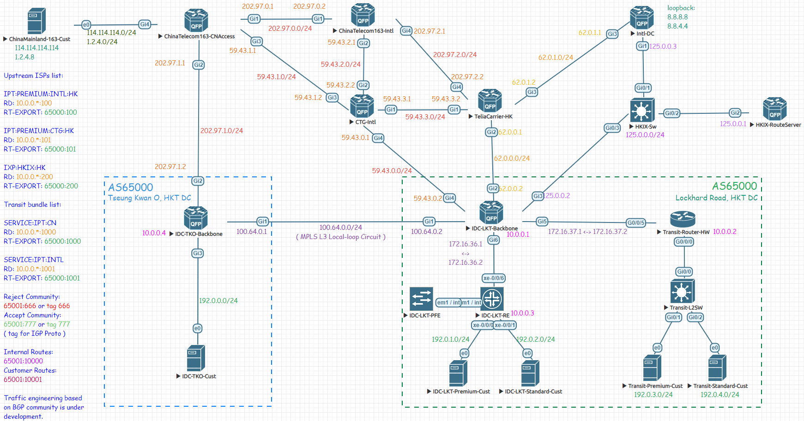
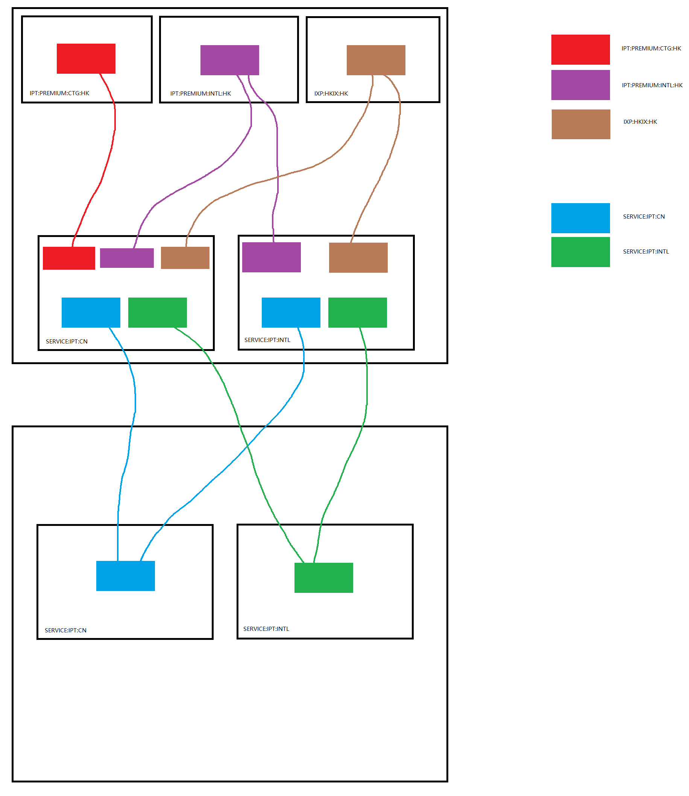

# [ BGP ] 使用 MBGP+MPLS+VRF 搭建多地互联数据中心网络

2020年5月28日 - [BGP](https://littlewolf.moe/category/bgp/), [Cisco](https://littlewolf.moe/category/cisco-platform/), [Huawei](https://littlewolf.moe/category/huawei-platform/), [Juniper](https://littlewolf.moe/category/juniper-platform/)

[[ BGP \] 使用 MBGP+MPLS+VRF 搭建多地互联数据中心网络 | LittleWolf Network Universe](https://littlewolf.moe/juniper-platform/276/#comment-129)

感谢 LTY ([@lty1993](https://lty.me/)) 同学给我带来的想法，于是我写了这篇文章来整理搭建数据中心网络的思路。

这次我们使用之前提到过的知识，来搭建一个基于 MBGP+MPLS+VRF 的网络。

为什么使用 MPLS+MBGP 而不使用传统的 IP 路由？总结起来有以下几点优点：

- 高弹性。MPLS启动后，带宽的扩容，流量的调度将非常的方便，核心路由器无需接收全网路由表，只需要接收基于 OSPF 协议发来的内网路由以及基于 LDP 协议发来的标签映射消息即可按照标签进行转发。
- 高冗余。启动 MPLS 后，网内可以开启基于 MPLS 的高速冗余措施，如 MPLS Fast Reroute 等技术。可以保证当主要链路 DOWN 掉后，备份 LSP 链路能快速使网络恢复工作。
- 高控制性。MPLS 可以根据标签来做 Traffic-engineering，可以根据标签进行 QoS，也可以基于标签来手动控制数据包的路径走向（RSVP）
- 高拓展性。你可以配置基于 MPLS 的跨地区的二层网络 （VXLAN/VPLS），也可以提供基于 MPLS 封装的 L2-Circuit 服务（Ethernet/VLAN-CCC），就像你真的用一根物理线经过几个地区将两地的设备连接在一起一样。

 

这次我们就用 Cisco, Juniper, Huawei 的设备来模拟搭建多地互联的数据中心。

Update 1.0：由于 Huawei 以及 Cisco 设备启动 VRF BGP 后，MBGP 给路由的 bottom mpls label 的封装模式是 per-route，如果你一个 VRF 收了 81 万的全表，路由器的 MPLS 标签很快就就会被消耗殆尽。所以，我们必须避免这种情况的发生。

解决方案如下：

Huawei: [Click me](https://support.huawei.com/enterprise/en/doc/EDOC1100039592/a3af94bc/apply-label)
Cisco: [Click me](https://www.cisco.com/c/en/us/td/docs/ios-xml/ios/mp_l3_vpns/configuration/15-mt/mp-l3-vpns-15-mt-book/mp-vpn-vrf-label.html)

**拓扑整图如下：**



由于懒得做 IP 规划管理了，这次我直接将这几家运营商的经常在公网见到的路由 IP 作为模拟实验的公网 IP 地址。

**前情提要：**

公司因业务需求，在将军澳 (Tsueng Kwan O, 蓝色区域) 与湾仔駱克道 (Lockhart Road, 绿色区域) 租用了机柜，并向香港运营商购买了本地 Local-loop 以实现两区域内网互通的需求。

Transit 方面，LKT 机房向 China Telecom Global 以及 Telia Carrier 购买了境内/国际方向的带宽，并且拉了一条 HKIX 用于传输与内容提供商产生的流量。

**网络需求：**

- LKT 机房内，Premium Customer 拥有全网网络权限，回境内流量可经 CN2 通信，Standard 则不可以。Standard 亦不可使用 TKO 机房的廉价 163 回程带宽。
- TKO 机房不允许使用 LKT 机房的上游带宽。
- 流量必须经过路由择优选路转发至各个上游以及 IXP最大化利用带宽（不允许使用 Policy-based route）
- LKT 机房内的 Transit branch, 客户租用了一个接口，但是要求 192.0.3.0/24 使用 Premium 路由包，192.0.4.0/24 使用 Standard 路由包。
- 路由拓扑需具有可拓展性，为以后的扩容/互联做准备。

 

**使用的技术：**

- OSPFv2 （内网设备通信用）
- MPLS （跨数据中心传输，以及为不同流量打标签）
- VRF （区分上游，客户，自有网段）
- MBGP（传输客户客户路由，Transit 路由等控制信息）

 

**预先工作：**

- 按照拓扑图所示配置好两区域机房的接口 IP 地址，如：物理接口 IP，回环接口 IP 等。
- 预配置好 OSPF 以及 LDP 协议，使网络具备分发标签，传输封装后报文的能力。

 

配置完成后，我们来验证一下协议的工作状态。

**检查 LKT-Backbone 的 OSPF 邻居，以及 OSPF LSDB 状态：**

```
IDC-LKT-Backbone#show ip ospf neighbor
Neighbor ID     Pri   State           Dead Time   Address         Interface
10.0.0.2          1   FULL/BDR        00:00:37    172.16.37.2     GigabitEthernet5
10.0.0.3        128   FULL/BDR        00:00:39    172.16.36.2     GigabitEthernet6
10.0.0.4          1   FULL/DR         00:00:37    100.64.0.1      GigabitEthernet1
```

```
IDC-LKT-Backbone#show ip ospf database
            OSPF Router with ID (10.0.0.1) (Process ID 1)
                Router Link States (Area 0)
Link ID         ADV Router      Age         Seq#       Checksum Link count
10.0.0.1        10.0.0.1        45          0x8000016F 0x001E7D 4
10.0.0.2        10.0.0.2        52          0x80000005 0x00DF74 2
10.0.0.3        10.0.0.3        2250        0x800000F4 0x00AA98 2
10.0.0.4        10.0.0.4        622         0x800000DD 0x00B817 2
172.16.37.2     172.16.37.2     1379        0x80000067 0x004DF3 2
                Net Link States (Area 0)
Link ID         ADV Router      Age         Seq#       Checksum
100.64.0.1      10.0.0.4        622         0x80000005 0x00E97F
172.16.36.1     10.0.0.1        199         0x80000005 0x00032E
172.16.37.1     10.0.0.1        51          0x80000001 0x00F143
```


经检查，OSPF 邻接关系建立正常，LSDB 传输正常。据此可判断下游交换机、华为路由器和 TKO 机房的骨干路由器的 OSPF 也正常。

**检查 TKO & LKT 两区域路由器的 MPLS 以及 LDP 的邻居建立关系：**

```
IDC-LKT-Backbone#show mpls ldp neighbor
    Peer LDP Ident: 10.0.0.4:0; Local LDP Ident 10.0.0.1:0
        TCP connection: 10.0.0.4.16043 - 10.0.0.1.646
        State: Oper; Msgs sent/rcvd: 175/179; Downstream
        Up time: 02:25:20
        LDP discovery sources:
          GigabitEthernet1, Src IP addr: 100.64.0.1
        Addresses bound to peer LDP Ident:
          10.0.0.4        100.64.0.1      202.97.1.2
    Peer LDP Ident: 10.0.0.3:0; Local LDP Ident 10.0.0.1:0
        TCP connection: 10.0.0.3.57153 - 10.0.0.1.646
        State: Oper; Msgs sent/rcvd: 971/850; Downstream
        Up time: 02:20:36
        LDP discovery sources:
          GigabitEthernet6, Src IP addr: 172.16.36.2
        Addresses bound to peer LDP Ident:
          172.16.36.2
    Peer LDP Ident: 10.0.0.2:0; Local LDP Ident 10.0.0.1:0
        TCP connection: 10.0.0.2.59507 - 10.0.0.1.646
        State: Oper; Msgs sent/rcvd: 28/24; Downstream
        Up time: 00:03:56
        LDP discovery sources:
          GigabitEthernet5, Src IP addr: 172.16.37.2
        Addresses bound to peer LDP Ident:
          172.16.37.2     10.0.0.2
```

```
IDC-LKT-Backbone#show mpls forwarding-table
Local      Outgoing   Prefix           Bytes Label   Outgoing   Next Hop
Label      Label      or Tunnel Id     Switched      interface
16         Pop Label  10.0.0.2/32      0             Gi5        172.16.37.2
17         Pop Label  10.0.0.4/32      0             Gi1        100.64.0.1
30         Pop Label  10.0.0.3/32      0             Gi6        172.16.36.2
```

MPLS LDP 已经建立，且 MPLS LSP 已经分发完成且条目无问题。

下面我们来配置 BGP协议。

 

### **准备阶段：定义不同流量使用不同的 VRF 来进行打包的规则**

 ```
 Upstream ISPs list:
 IPT:PREMIUM:INTL:HK // 从国际运营商，如 Telia 收到的路由
 RD: 10.0.0.*:100
 RT-EXPORT: 65000:100
 IPT:PREMIUM:CTG:HK // 从中国境内运营商，如 CTG 收到的路由
 RD: 10.0.0.*:101
 RT-EXPORT: 65000:101
 IXP:HKIX:HK // 从交换中心收到的路由，如 HKIX
 RD: 10.0.0.*:200
 RT-EXPORT: 65000:200
 Transit bundle list:
 SERVICE:IPT:CN // Premium 用户使用的路由包
 RD: 10.0.0.*:1000
 RT-EXPORT: 65000:1000
 SERVICE:IPT:INTL // Standard 用户使用的路由包
 RD: 10.0.0.*:1001
 RT-EXPORT: 65000:1001
 Reject Community: // 定义拒绝/接受的 BGP community，留作之后冗余用
 65001:666 or tag 666
 Accept Community:
 65001:777 or tag 777
 ( tag for IGP Proto )
 Internal Routes: // 定义收到的路由打上什么样的 BGP community
 65001:10000
 Customer Routes:
 65001:10001
 ```


### **第一阶段：配置 LKT 机房内的路由器与交换机，路由器与 Upstream 的互联**

 

**IDC-LKT-Backbone**

```
IDC-LKT-Backbone#show run
Building configuration...
!
ip vrf IPT:PREMIUM:CTG:HK   // 定义 CTG Transit 的路由属性
 rd 10.0.0.1:101
 route-target export 65000:101  // 向内网传送路由时携带该 ext-community
 route-target import 65000:1000 // 从 Premium 路由包导入内网/客户路由
 route-target import 65000:1001 // 从 Standard 路由包导入内网/客户路由
!
ip vrf IPT:PREMIUM:INTL:HK  // 定义 Telia Transit 的路由属性
 rd 10.0.0.1:100
 route-target export 65000:100  // 向内网传送路由时携带该 ext-community
 route-target import 65000:1000 // 从 Premium 路由包导入内网/客户路由
 route-target import 65000:1001 // 从 Standard 路由包导入内网/客户路由
!
ip vrf IXP:HKIX:HK      // 定义 HKIX IXP 的路由属性
 rd 10.0.0.1:200
 route-target export 65000:200  // 向内网传送路由时携带该 ext-community
 route-target import 65000:1000 // 从 Premium 路由包导入内网/客户路由
 route-target import 65000:1001 // 从 Standard 路由包导入内网/客户路由
!
ip vrf SERVICE:IPT:CN    // 定义 Premium 路由包的路由属性
 rd 10.0.0.1:1000
 route-target export 65000:1000 // 发布路由的时候携带该属性的 ext-community
 route-target import 65000:1000 // 从交换机导入 Premium 客户的路由（用于内网互通）
 route-target import 65000:1001 // 从交换机导入 Standard 客户的路由（用于内网互通）
 route-target import 65000:200  // 导入 HKIX 路由
 route-target import 65000:100  // 导入 CTG 路由（Premium 客户专享）
 route-target import 65000:101  // 导入 Telia 路由 （国际 Transit）
!
ip vrf SERVICE:IPT:INTL     // 定义 Standard 路由包的属性
 rd 10.0.0.1:1001
 route-target export 65000:1001 // 发布路由的时候携带该属性的 ext-community
 route-target import 65000:1001 // 从交换机导入 Standard 客户的路由（用于内网互通）
 route-target import 65000:200  // 导入 HKIX 路由
 route-target import 65000:100  // 导入 Telia 路由（国际 Transit）
 route-target import 65000:1000 // 从交换机导入 Premium 客户的路由（用于内网互通）
```


```
// 将各个与运营商对接的接口绑定至对应的 VRF instance
interface GigabitEthernet2
 ip vrf forwarding IPT:PREMIUM:INTL:HK
 ip address 62.0.0.2 255.255.255.0
 negotiation auto
 no mop enabled
 no mop sysid
!
interface GigabitEthernet3
 ip vrf forwarding IXP:HKIX:HK
 ip address 125.0.0.2 255.255.255.0
 negotiation auto
 no mop enabled
 no mop sysid
!
interface GigabitEthernet4
 ip vrf forwarding IPT:PREMIUM:CTG:HK
 ip address 59.43.0.2 255.255.255.0
 negotiation auto
 no mop enabled
 no mop sysid
```

```
router bgp 65000
 bgp log-neighbor-changes
 no bgp default ipv4-unicast
 neighbor 10.0.0.2 remote-as 65000 // 建立与 Transit branch 路由器的邻居
 neighbor 10.0.0.2 update-source Loopback0 // 使用 loopback 接口与内网建立 ibgp 邻居
 neighbor 10.0.0.3 remote-as 65000 // 建立与 TKO 机房路由器的邻居
 neighbor 10.0.0.3 update-source Loopback0 // 使用 loopback 接口与内网建立 ibgp 邻居
 neighbor 10.0.0.4 remote-as 65000 // 建议与下游交换机的邻居关系
 neighbor 10.0.0.4 update-source Loopback0 // 使用 loopback 接口与内网建立 ibgp 邻居
 !
 address-family vpnv4 // VPNv4 address-family，用于传递 VRF 路由
  neighbor 10.0.0.2 activate // 激活与 Transit branch 的 VPNv4 safi
  neighbor 10.0.0.2 send-community both // 发送 standard + extend community，其中 standard community 用于做路由流量调度或路由标记，extend community 用于区分不同 VRF 的路由
  neighbor 10.0.0.2 route-reflector-client // 打开 route-reflect-server，反射从其他 ibgp 邻居接收的路由给该 BGP 邻居
  neighbor 10.0.0.3 activate // 激活与 TKO 机房路由器的 VPNv4 safi
  neighbor 10.0.0.3 send-community both // 同上
  neighbor 10.0.0.3 route-reflector-client // 打开 route-reflect-server，反射从其他 ibgp 邻居接收的路由给该 BGP 邻居
  neighbor 10.0.0.4 activate // 激活与下游交换机的 VPNv4 safi
  neighbor 10.0.0.4 send-community both // 同上
  neighbor 10.0.0.4 route-reflector-client // 打开 route-reflect-server，反射从其他 ibgp 邻居接收的路由给该 BGP 邻居
 exit-address-family
 !
 address-family ipv4 vrf IPT:PREMIUM:CTG:HK // 进入对应 VRF 的 BGP 子进程
  neighbor 59.43.0.1 remote-as 4809
  neighbor 59.43.0.1 activate
  neighbor 59.43.0.1 weight 40000 // 流量调度用
 exit-address-family
 !
 address-family ipv4 vrf IPT:PREMIUM:INTL:HK // 同上
  neighbor 62.0.0.1 remote-as 1299
  neighbor 62.0.0.1 activate
  neighbor 62.0.0.1 allowas-in 1
 exit-address-family
 !
 address-family ipv4 vrf IXP:HKIX:HK // 同上
  neighbor 125.0.0.1 remote-as 4635
  neighbor 125.0.0.1 activate
 exit-address-family
 !
 address-family ipv4 vrf SERVICE:IPT:CN // 进入对应 Premium 路由包的子进程
  network 0.0.0.0 // 向路由包内宣告默认路由
 exit-address-family
 !
 address-family ipv4 vrf SERVICE:IPT:INTL // 进入对应 Standard 路由包的子进程
  network 0.0.0.0 // 向路由包内宣告默认路由
 exit-address-family
!
// 使用 network 的方式是因为 Cisco 好像并不能在 VPNv4 safi 中针对邻居的 VRF instance 发送默认路由，redistribute 也是没有用的。最终找到有用的方法就是手动汇总默认路由后再使用 network 命令宣告，如果有更好的办法还请不吝赐教。
ip route vrf SERVICE:IPT:CN 0.0.0.0 0.0.0.0 Null0
ip route vrf SERVICE:IPT:INTL 0.0.0.0 0.0.0.0 Null0
// 在 VRF 打包的路由包内手动汇总默认路由，以便 BGP 传给下游/其他方向的路由器或交换机。
```

**IDC-LKT-SWITCH:**

```
routing-instances {  
    SERVICE-IPT-CN { // Premium 路由包
        instance-type vrf; // 定义类型为 VRF
        interface xe-0/0/0.0; // 将 Premium 用户的接口划分到该路由包内
        route-distinguisher 10.0.0.3:1000; 
        vrf-import SERVICE:IPT:CN:IMPORT; // 定义通过 MP-BGP 导入 VRF 路由的规则
        vrf-export SERVICE:IPT:CN:EXPORT; // 定义即将通过 MP-BGP 导出 VRF 路由的 Pre-filter（预配置的filter，如果路由从此 VRF 出去，则会根据该 policy 进行属性的调整）
        vrf-table-label; // 打上双层标签。以太网类型的链路必须打，用于识别内层标签与 VRF 的 mapping 关系。PtP 链路可以不打。
    }
    SERVICE-IPT-INTL { // Standard 路由包
        instance-type vrf; // 定义类型为 VRF
        interface xe-0/0/1.0; // 将 Standard 用户的接口划分到该路由包内
        route-distinguisher 10.0.0.3:1001;
        vrf-import SERVICE:IPT:INTL:IMPORT; // 定义通过 MP-BGP 导入 VRF 路由的规则
        vrf-export SERVICE:IPT:INTL:EXPORT;  // 定义即将通过 MP-BGP 导出 VRF 路由的 Pre-filter
        vrf-table-label; // 打上双层标签。
    }
}
```

```
policy-options {
    policy-statement SERVICE:IPT:CN:EXPORT {
        term add-community-v4 { // 将 Premium 客户的网段宣告进 MP-BGP 协议中
            from {
                protocol [ direct static ];
                route-filter 192.0.1.0/24 exact;
            }
            then {
                community add internal-routes;
            }
        }
        term vrf-export {
            then {
                community add service:ipt:cn; // 如果从 VRF 导出，则携带该 ext-community 属性，上游收到后会将其放入对应的路由包内
                accept;
            }
        }
        term last {
            then reject;
        }
    }
    policy-statement SERVICE:IPT:CN:IMPORT {
        term vrf-import {
            from community service:ipt:cn; // 导入路由器发过来的对应路由包的路由（携带该 ext-community 的路由）
            then accept;
        }
        term last {
            then reject;
        }
    }
    policy-statement SERVICE:IPT:INTL:EXPORT {
        term add-community-v4 {  // 将 Standard 客户的网段宣告进 MP-BGP 协议中
            from {
                protocol [ direct static ];
                route-filter 192.0.2.0/24 exact;
            }
            then {
                community add internal-routes;
            }
        }
        term vrf-export {
            then {
                community add service:ipt:intl; // 如果从 VRF 导出，则携带该 ext-community 属性，上游收到后会将其放入对应的路由包内
                accept;
            }
        }
        term last {
            then reject;
        }
    }
    policy-statement SERVICE:IPT:INTL:IMPORT {
        term vrf-import {
            from community service:ipt:intl; // 导入路由器发过来的对应路由包的路由（携带该 ext-community 的路由）
            then accept;
        }
        term last {
            then reject;
        }
    }
    community customer-routes members 65001:10001;  // standard community, TE 用
    community internal-routes members 65001:10000; // standard community, TE 用
    community service:ipt:cn members target:65000:1000; // extend community，区分 VRF 路由用
    community service:ipt:intl members target:65000:1001; // extend community，区分 VRF 路由用
```

```
protocols {
    bgp {
        group MP-BGP {
            type internal;
            local-address 10.0.0.3; // 使用回环接口做 BGP 源更新地址
            family inet-vpn {
                unicast; // 激活该 BGP 组的 MP-BGP IPv4 Unicast address-family，使其能够传递 VPNv4 路由
            }
            local-as 65000;
            neighbor 10.0.0.1 { // 与上游路由器建立 BGP 连接
                description To-Huawei-MBGP-Core;
                peer-as 65000;
            }
        }
    }
```


配置完成后，我们来检查两台机器的路由表。

**IDC-LKT-Backbone:**

```
IDC-LKT-Backbone#show ip route vrf IPT:PREMIUM:INTL:HK
Routing Table: IPT:PREMIUM:INTL:HK

B*    0.0.0.0/0 [20/0], 21:38:31, Null0
      1.0.0.0/24 is subnetted, 1 subnets
B        1.2.4.0 [20/0] via 62.0.0.1, 21:38:32
      8.0.0.0/32 is subnetted, 2 subnets
B        8.8.4.4 [20/0] via 62.0.0.1, 21:38:32
B        8.8.8.8 [20/0] via 62.0.0.1, 21:38:32
      114.0.0.0/24 is subnetted, 1 subnets
B        114.114.114.0 [20/0] via 62.0.0.1, 21:38:32
B     192.0.1.0/24 [200/0] via 10.0.0.3, 21:34:06
B     192.0.2.0/24 [200/0] via 10.0.0.3, 21:34:06
B     192.0.3.0/24 [200/0] via 10.0.0.2, 19:17:15
B     192.0.4.0/24 [200/0] via 10.0.0.2, 19:17:15

IDC-LKT-Backbone#show ip route vrf IPT:PREMIUM:CTG:HK BGP
Routing Table: IPT:PREMIUM:CTG:HK

B*    0.0.0.0/0 [20/0], 21:38:40, Null0
      1.0.0.0/24 is subnetted, 1 subnets
B        1.2.4.0 [20/0] via 59.43.0.1, 21:38:41
      114.0.0.0/24 is subnetted, 1 subnets
B        114.114.114.0 [20/0] via 59.43.0.1, 21:38:41
B     192.0.1.0/24 [200/0] via 10.0.0.3, 21:34:15
B     192.0.2.0/24 [200/0] via 10.0.0.3, 21:34:15

IDC-LKT-Backbone#show ip route vrf IXP:HKIX:HK BGP
Routing Table: IXP:HKIX:HK

B*    0.0.0.0/0 [20/0], 21:38:51, Null0
      8.0.0.0/32 is subnetted, 2 subnets
B        8.8.4.4 [20/0] via 125.0.0.3, 14:46:20
B        8.8.8.8 [20/0] via 125.0.0.3, 14:46:20
B     192.0.1.0/24 [200/0] via 10.0.0.3, 21:34:26
B     192.0.2.0/24 [200/0] via 10.0.0.3, 21:34:26

IDC-LKT-Backbone#show ip route vrf SERVICE:IPT:CN
Routing Table: SERVICE:IPT:CN

S*    0.0.0.0/0 is directly connected, Null0
      1.0.0.0/24 is subnetted, 1 subnets
B        1.2.4.0 [20/0] via 59.43.0.1 (IPT:PREMIUM:CTG:HK), 21:39:20
      8.0.0.0/32 is subnetted, 2 subnets
B        8.8.4.4 [20/0] via 62.0.0.1 (IPT:PREMIUM:INTL:HK), 21:39:20
B        8.8.8.8 [20/0] via 62.0.0.1 (IPT:PREMIUM:INTL:HK), 21:39:20
      114.0.0.0/24 is subnetted, 1 subnets
B        114.114.114.0 [20/0] via 59.43.0.1 (IPT:PREMIUM:CTG:HK), 21:39:20
B     192.0.1.0/24 [200/0] via 10.0.0.3, 21:34:55
B     192.0.2.0/24 [200/0] via 10.0.0.3, 21:34:55

IDC-LKT-Backbone#show ip route vrf SERVICE:IPT:INTL
Routing Table: SERVICE:IPT:INTL

S*    0.0.0.0/0 is directly connected, Null0
      1.0.0.0/24 is subnetted, 1 subnets
B        1.2.4.0 [20/0] via 62.0.0.1 (IPT:PREMIUM:INTL:HK), 21:39:24
      8.0.0.0/32 is subnetted, 2 subnets
B        8.8.4.4 [20/0] via 62.0.0.1 (IPT:PREMIUM:INTL:HK), 21:39:24
B        8.8.8.8 [20/0] via 62.0.0.1 (IPT:PREMIUM:INTL:HK), 21:39:24
      114.0.0.0/24 is subnetted, 1 subnets
B        114.114.114.0 [20/0] via 62.0.0.1 (IPT:PREMIUM:INTL:HK), 21:39:24
B     192.0.1.0/24 [200/0] via 10.0.0.3, 21:34:59
B     192.0.2.0/24 [200/0] via 10.0.0.3, 21:34:59
```


**IDC-LKT-SWITCH:**

```
root@IDC-LKT-RE> show route table SERVICE-IPT-CN.inet.0
SERVICE-IPT-CN.inet.0: 5 destinations, 5 routes (5 active, 0 holddown, 0 hidden)
+ = Active Route, - = Last Active, * = Both
0.0.0.0/0          *[BGP/170] 21:38:09, MED 0, localpref 100, from 10.0.0.1
                      AS path: I, validation-state: unverified
                    > to 172.16.36.1 via xe-0/0/6.0, Push 28
192.0.1.0/24       *[Direct/0] 21:38:53
                    > via xe-0/0/0.0
192.0.1.1/32       *[Local/0] 21:38:53
                      Local via xe-0/0/0.0
{master:0}
root@IDC-LKT-RE> show route table SERVICE-IPT-INTL.inet.0
SERVICE-IPT-INTL.inet.0: 3 destinations, 3 routes (3 active, 0 holddown, 0 hidden)
+ = Active Route, - = Last Active, * = Both
0.0.0.0/0          *[BGP/170] 21:38:19, MED 0, localpref 100, from 10.0.0.1
                      AS path: I, validation-state: unverified
                    > to 172.16.36.1 via xe-0/0/6.0, Push 29
192.0.2.0/24       *[Direct/0] 21:39:03
                    > via xe-0/0/1.0
192.0.2.1/32       *[Local/0] 21:39:03
                      Local via xe-0/0/1.0
```


上游路由器的与 ISP 相连的 VRF，使用 VRF 打包为客户提供服务的路由包均已正常收到对应的路由，下游也收到了对应的默认路由，路由表一切正常。

那么有人就会有疑问了，为什么上游路由器的路由包收到了 ISP 的路由（从与 ISP 相连的 VRF 导入的），却不会传递给下游交换机？明明路由包里面有了 ISP 的路由，按道理来说应该会传给交换机的啊？

原理就是，BGP 路由在传递 / 路由器内导入及导出的时候，所携带的 extend community 值是不会改变的！由于导入路由包的 ISP 路由 ext-community 依旧是原先携带的值，下游交换机的 import policy 并没有匹配到该属性值，所以并不会导入 ISP 的路由，也就不用担心会撑爆交换机的转发平面！

```
IDC-LKT-Backbone#show ip bgp vpnv4 vrf SERVICE:IPT:CN 8.8.8.8 255.255.255.255
BGP routing table entry for 10.0.0.1:1000:8.8.8.8/32, version 22
Paths: (2 available, best #2, table SERVICE:IPT:CN)
  Not advertised to any peer
  Refresh Epoch 1
  4635 15169, imported path from 10.0.0.1:200:8.8.8.8/32 (IXP:HKIX:HK)
    125.0.0.3 (via vrf IXP:HKIX:HK) (via IXP:HKIX:HK) from 125.0.0.1 (125.0.0.1)
      Origin IGP, localpref 100, valid, external
      Extended Community: RT:65000:200
      rx pathid: 0, tx pathid: 0
  Refresh Epoch 1
  1299 15169, imported path from 10.0.0.1:100:8.8.8.8/32 (IPT:PREMIUM:INTL:HK)
    62.0.0.1 (via vrf IPT:PREMIUM:INTL:HK) (via IPT:PREMIUM:INTL:HK) from 62.0.0.1 (202.97.2.2)
      Origin IGP, localpref 100, valid, external, best
      Extended Community: RT:65000:100
      rx pathid: 0, tx pathid: 0x0
```


可以看到 ISP 路由携带的是 RT:65000:100 的 ext-community，而我们并没有在交换机上配置引入该团体属性值的路由，所以并不会在交换机上引入路由包收到的路由！

如果还是有疑惑的话，请看这张图：



由于我们配置的 Policy 是指定路由包 VRF 的互相导入/导出，所以交换机和路由器的路由条目仅限于蓝色与绿色（如图所示），代表 ISP 的三种颜色的路由不会被导入。

路由表检查完毕，我们来验证一下数据包转发路径。

**IDC-LKT-Premium-Cust:**

```
root@localhost:~# mtr 114.114.114.114 --report --no-dns
Start: 2020-05-28T06:39:01+0000
HOST: localhost                   Loss%   Snt   Last   Avg  Best  Wrst StDev
  1.|-- 192.0.1.1                  0.0%    10  117.6 149.1 106.6 208.8  36.4
  2.|-- 172.16.36.1                0.0%    10  119.9 126.8 107.5 158.2  17.7
  3.|-- 59.43.0.1                  0.0%    10  122.6 138.7 108.0 203.8  33.5
  4.|-- 59.43.1.1                  0.0%    10  124.6 136.1 109.5 206.0  28.9
  5.|-- 114.114.114.114            0.0%    10  126.0 133.4 106.3 204.8  29.6
root@localhost:~# mtr 8.8.4.4 --report --no-dns
Start: 2020-05-28T06:39:51+0000
HOST: localhost                   Loss%   Snt   Last   Avg  Best  Wrst StDev
  1.|-- 192.0.1.1                  0.0%    10  105.0 127.3 104.1 176.6  30.8
  2.|-- 172.16.36.1                0.0%    10  105.0 124.7 104.0 171.5  25.3
  3.|-- 62.0.0.1                   0.0%    10  105.4 134.2 104.0 181.4  36.8
  4.|-- 8.8.4.4                    0.0%    10  104.7 123.5 103.8 174.0  26.4
root@localhost:~# mtr 8.8.8.8 --report --no-dns
Start: 2020-05-28T06:42:54+0000
HOST: localhost                   Loss%   Snt   Last   Avg  Best  Wrst StDev
  1.|-- 192.0.1.1                  0.0%    10  106.0 106.3 104.0 111.4   2.6
  2.|-- 172.16.36.1                0.0%    10  105.9 123.0 103.9 200.8  35.1
  3.|-- 8.8.8.8                    0.0%    10  175.7 139.0 104.2 202.6  41.0
```


**IDC-LKT-Standard-Cust:**

```
root@localhost:~# mtr 114.114.114.114 --report --no-dns
[87953.252456] sctp: Hash tables configured (bind 256/256)
Start: 2020-05-28T06:39:19+0000
HOST: localhost                   Loss%   Snt   Last   Avg  Best  Wrst StDev
  1.|-- 192.0.2.1                 10.0%    10  150.8 146.5 108.4 180.6  24.2
  2.|-- 172.16.36.1                0.0%    10  186.8 166.8 112.3 205.8  32.7
  3.|-- 62.0.0.1                   0.0%    10  120.9 139.5 110.8 202.0  34.3
  4.|-- 202.97.2.1                 0.0%    10  155.9 145.8 114.1 176.0  19.2
  5.|-- 202.97.0.1                 0.0%    10  190.4 171.4 109.4 201.1  32.7
  6.|-- 114.114.114.114            0.0%    10  124.7 126.3 105.8 172.9  20.6
root@localhost:~# mtr 8.8.8.8 --report --no-dns
Start: 2020-05-28T06:43:02+0000
HOST: localhost                   Loss%   Snt   Last   Avg  Best  Wrst StDev
  1.|-- 192.0.2.1                  0.0%    10  178.8 127.2 104.7 178.8  30.0
  2.|-- 172.16.36.1                0.0%    10  104.1 119.0 104.1 206.7  32.9
  3.|-- 8.8.8.8                    0.0%    10  165.6 138.3 104.4 204.1  40.1
root@localhost:~# mtr 8.8.4.4 --report --no-dns
Start: 2020-05-28T06:43:28+0000
HOST: localhost                   Loss%   Snt   Last   Avg  Best  Wrst StDev
  1.|-- 192.0.2.1                  0.0%    10  174.3 134.9 104.1 201.5  35.3
  2.|-- 172.16.36.1                0.0%    10  126.3 123.5 104.9 192.9  28.0
  3.|-- 62.0.0.1                   0.0%    10  105.2 119.4 103.5 170.4  24.0
  4.|-- 8.8.4.4                    0.0%    10  103.8 128.7 103.8 205.7  40.1
```


**China-Mainland-Server:**

```
root@localhost:~# mtr 192.0.1.2 --report --no-dns
Start: 2020-05-28T06:40:08+0000
HOST: localhost                   Loss%   Snt   Last   Avg  Best  Wrst StDev
  1.|-- 114.114.114.1              0.0%    10    1.0   0.9   0.7   1.0   0.1
  2.|-- 59.43.1.2                  0.0%    10    1.6   1.5   1.3   1.8   0.1
  3.|-- 59.43.0.2                  0.0%    10    1.8   1.8   1.5   2.0   0.1
  4.|-- 192.0.1.1                  0.0%    10  107.3 110.9 105.8 147.9  13.0
  5.|-- 192.0.1.2                  0.0%    10  109.3 118.4 106.8 165.5  21.1
root@localhost:~# mtr 192.0.2.2 --report --no-dns
Start: 2020-05-28T06:43:09+0000
HOST: localhost                   Loss%   Snt   Last   Avg  Best  Wrst StDev
  1.|-- 114.114.114.1              0.0%    10    1.0   0.9   0.7   1.0   0.1
  2.|-- 202.97.0.2                 0.0%    10    1.5   1.4   1.2   2.0   0.2
  3.|-- 202.97.2.2                 0.0%    10    2.1   2.1   1.6   2.8   0.4
  4.|-- 62.0.0.2                   0.0%    10    2.3   2.2   1.9   2.4   0.2
  5.|-- 192.0.2.1                  0.0%    10  179.2 123.8 105.5 179.2  29.5
  6.|-- 192.0.2.2                  0.0%    10  113.5 141.2 112.5 186.1  20.5
```

如上所示，Premium 客户与境内通信去程/回程均为 CN2 线路，Standard 客户均为经由 Telia 转接的普通 163 线路，且两种不同类型的客户均可以利用上 IXP 与 ISP 的链路，符合要求预期。第一阶段完成。

 

### **第二阶段：配置 TKO 机房的路由器，使 TKO 与 LKT 机房建立三层互联**

 

建立 TKO 机柜后，基于业务上的需求，我们希望 Premium 客户能直接通过 Local-loop 实现跨机房内网互通，实现高质量的连接效果，而 Standard 客户则通过 Transit 互通，不允许使用 Local-loop 进行传输。我们则需要进行以下的配置：

**IDC-TKO-Backbone**

```
ip vrf SERVICE:IPT:CN // 定义客户用 VRF 路由包
 rd 10.0.0.4:1000
 export ipv4 unicast map export-local // 导出客户路由到 Global 路由表，向 Transit 宣告
 route-target export 65000:1002 // 向内网传送路由时携带该 ext-community
 route-target import 65000:1000 // 从 LKT 机房的 Premium 路由包导入内网/客户路由
!
interface GigabitEthernet3
 ip vrf forwarding SERVICE:IPT:CN
 ip address 192.0.0.1 255.255.255.0
 negotiation auto
 no mop enabled
 no mop sysid
!
// 绑定客户服务接口进 VRF instance
ip route vrf SERVICE:IPT:CN 0.0.0.0 0.0.0.0 202.97.1.1 global
// 默认路由指向 Transit （基于业务要求，只允许使用本地的 Transit）
ip prefix-list export-local seq 5 permit 192.0.0.0/24
!
route-map export-local permit 100
 match ip address prefix-list export-local
// 控制 VRF Export map，导出路由至 Global 路由表
```

```
router bgp 65000
 bgp router-id 10.0.0.4
 bgp log-neighbor-changes
 no bgp default ipv4-unicast
 neighbor 10.0.0.1 remote-as 65000 // 建立与 LKT 核心路由器的邻居
 neighbor 10.0.0.1 update-source Loopback0 // 使用 loopback 接口与内网建立 ibgp 邻居
 neighbor 202.97.1.1 remote-as 4134 // 建立与 ISP 的邻居
 !
 address-family ipv4
  neighbor 202.97.1.1 activate // 激活与 ISP 的邻居关系
 exit-address-family
 !
 address-family vpnv4
  neighbor 10.0.0.1 activate // 激活与 LKT 核心路由器的邻居关系
  neighbor 10.0.0.1 send-community extended // 发送 standard + extend community，其中 standard community 用于做路由流量调度或路由标记，extend community 用于区分不同 VRF 的路由
 exit-address-family
 !
 address-family ipv4 vrf SERVICE:IPT:CN
  network 192.0.0.0 // 宣告客户的网段进 BGP VPNv4 进程
 exit-address-family
!
```

**IDC-LKT-Backbone**

```
ip vrf SERVICE:IPT:CN
 route-target import 65000:1002
// Premium 路由包导入 TKO 机房的客户路由包的路由即可
```

配置完毕，我们来检查一下路由表：

```
IDC-LKT-Backbone#show ip route vrf SERVICE:IPT:CN
Routing Table: SERVICE:IPT:CN
S*    0.0.0.0/0 is directly connected, Null0
      1.0.0.0/24 is subnetted, 1 subnets
B        1.2.4.0 [20/0] via 59.43.0.1 (IPT:PREMIUM:CTG:HK), 1d01h
      8.0.0.0/32 is subnetted, 2 subnets
B        8.8.4.4 [20/0] via 62.0.0.1 (IPT:PREMIUM:INTL:HK), 1d01h
B        8.8.8.8 [20/0] via 125.0.0.3 (IXP:HKIX:HK), 00:40:34
      114.0.0.0/24 is subnetted, 1 subnets
B        114.114.114.0 [20/0] via 59.43.0.1 (IPT:PREMIUM:CTG:HK), 1d01h
B     192.0.0.0/24 [200/0] via 10.0.0.4, 1d01h    // 已经收到来自 TKO 机房的路由
B     192.0.1.0/24 [200/0] via 10.0.0.3, 1d01h
B     192.0.2.0/24 [200/0] via 10.0.0.3, 1d01h
B     192.0.3.0/24 [200/0] via 10.0.0.2, 22:44:53
B     192.0.4.0/24 [200/0] via 10.0.0.2, 22:44:53
```

```
IDC-TKO-Backbone#show ip route vrf SERVICE:IPT:CN
Routing Table: SERVICE:IPT:CN
S*    0.0.0.0/0 [1/0] via 202.97.1.1
      192.0.0.0/24 is variably subnetted, 2 subnets, 2 masks
C        192.0.0.0/24 is directly connected, GigabitEthernet3
L        192.0.0.1/32 is directly connected, GigabitEthernet3 // 已经收到来自 LKT 机房 Premium 路由包的客户路由
B     192.0.1.0/24 [200/0] via 10.0.0.3, 1d01h
```

路由表没有问题，我们来检查一下数据转发路径。

**IDC-LKT-Premium-Cust:**

```
root@localhost:~# mtr 192.0.0.2 --report --no-dns
Start: 2020-05-28T07:28:02+0000
HOST: localhost Loss% Snt Last Avg Best Wrst StDev
1.|-- 192.0.1.1 0.0% 10 160.9 140.8 104.6 190.4 29.1
2.|-- 172.16.36.1 0.0% 10 112.4 139.8 105.0 197.0 41.4 
3.|-- 192.0.0.1 0.0% 10 104.7 132.4 104.1 202.3 38.6 // 直接通过 local-loop 访问 TKO 机房服务器
4.|-- 192.0.0.2 0.0% 10 192.3 134.2 103.8 192.3 41.1
```

**IDC-LKT-Standard-Cust:**

```
root@localhost:~# mtr 192.0.0.2 --report --no-dns
Start: 2020-05-28T07:27:51+0000
HOST: localhost Loss% Snt Last Avg Best Wrst StDev
1.|-- 192.0.2.1 0.0% 10 182.6 166.5 105.6 201.8 31.2
2.|-- 172.16.36.1 0.0% 10 140.7 142.3 106.1 192.5 26.4
3.|-- 62.0.0.1 0.0% 10 199.4 170.2 106.7 202.1 37.3 // 绕道 Transit 访问 TKO 机房服务器
4.|-- 202.97.2.1 0.0% 10 157.4 159.5 107.3 201.5 30.4
5.|-- 202.97.0.1 0.0% 10 115.6 145.3 106.8 199.0 38.5
6.|-- ??? 100.0 10 0.0 0.0 0.0 0.0 0.0
7.|-- 192.0.0.2 0.0% 10 132.1 122.8 103.8 160.9 17.4
```

**IDC-TKO-Cust:**

```
root@localhost:~# mtr 192.0.1.2 --report --no-dns // 访问 LKT Premium Customer
[90989.310341] sctp: Hash tables configured (bind 256/256)
Start: 2020-05-28T07:28:15+0000
HOST: localhost                   Loss%   Snt   Last   Avg  Best  Wrst StDev
  1.|-- 192.0.0.1                  0.0%    10    1.0   1.0   0.8   1.2   0.1
  2.|-- 100.64.0.2                 0.0%    10   52.1  16.6   5.1  67.0  22.9 // 直接通过 local-loop 访问 LKT 机房服务器
  3.|-- 192.0.1.1                  0.0%    10  107.3 124.5 105.2 205.1  37.9
  4.|-- 192.0.1.2                  0.0%    10  105.6 124.1 105.1 164.1  24.3
root@localhost:~# mtr 192.0.2.2 --report --no-dns // 访问 LKT Standard Customer
Start: 2020-05-28T07:28:37+0000
HOST: localhost                   Loss%   Snt   Last   Avg  Best  Wrst StDev
  1.|-- 192.0.0.1                  0.0%    10    0.8   0.9   0.8   1.0   0.1
  2.|-- 202.97.1.1                 0.0%    10    1.2   1.4   1.2   1.7   0.2 // 绕道 Transit 访问 LKT 机房服务器
  3.|-- 202.97.0.2                 0.0%    10    1.9   1.8   1.5   2.0   0.2
  4.|-- 202.97.2.2                 0.0%    10    2.4   2.3   2.0   2.6   0.2
  5.|-- 62.0.0.2                   0.0%    10    2.7   2.8   2.6   3.0   0.1
  6.|-- 192.0.2.1                  0.0%    10  108.6 116.3 106.7 191.3  26.4
  7.|-- 192.0.2.2                  0.0%    10  167.7 166.5 109.1 204.0  26.4
root@localhost:~# mtr 114.114.114.114 --report --no-dns // 公网路由，直接经过本地 Transit 访问
Start: 2020-05-28T07:29:04+0000
HOST: localhost                   Loss%   Snt   Last   Avg  Best  Wrst StDev
  1.|-- 192.0.0.1                  0.0%    10    0.9  15.3   0.9 143.0  44.9
  2.|-- 202.97.1.1                 0.0%    10    1.2   1.9   1.2   6.6   1.7
  3.|-- 114.114.114.114            0.0%    10    1.5  41.2   1.4 398.9 125.7
```

如上图所示，LKT Premium 客户与 TKO 客户实现了内网互通，而 Standard 客户通过 Transit 绕行，符合业务需求。

 

### **第三阶段：配置 LKT 机房的 Transit branch，使 其符合业务需求**

 

该阶段需求：LKT 机房内的 Transit branch, 客户租用了一个接口，但是要求 192.0.3.0/24 使用 Premium 路由包，192.0.4.0/24 使用 Standard 路由包。

到这里来有点挑战性了，因为我们拓扑的业务流量区分是基于接口来做的，但是这次客户是要求使用一个接口，因为客户的服务器要配置单网卡多 IP （这里模拟环境模拟不成功，我们使用两台服务器代替），不希望插两个接口，希望只使用一个接口来解决这个需求。

可以做吗？当然能！所以我们这次需要使用 Traffic-policy 将指定的 IP 地址送进对应的 VRF instance 以实现客户的需求。Transit branch 使用的是 Huawei 的 AR 路由器，以下是基于该路由器的命令。

**Transit-Router-HW:**

```
<Transit-Router-HW>dis current-configuration
#
ip vpn-instance SERVICE:IPT:CN // Premium 路由包
 ipv4-family
  route-distinguisher 10.0.0.2:1000
  vpn-target 65000:1000 export-extcommunity // 向内网传送路由时携带该 ext-community
  vpn-target 65000:1000 65000:1002 import-extcommunity // 导入 LKT 骨干路由器的 Premium 路由包以及 TKO 机房的客户路由
#
ip vpn-instance SERVICE:IPT:INTL // Standard 路由包
 ipv4-family
  route-distinguisher 10.0.0.2:1001
  vpn-target 65000:1001 export-extcommunity // 向内网传送路由时携带该 ext-community
  vpn-target 65000:1001 import-extcommunity // 导入 LKT 骨干路由器的 Standard 路由包
#
bgp 65000
 undo default ipv4-unicast
 peer 10.0.0.1 as-number 65000 // 建立与 LKT 路由器的邻居
 peer 10.0.0.1 connect-interface LoopBack0 // 使用回环地址作为更新源
 #
 ipv4-family vpnv4
  policy vpn-target
  peer 10.0.0.1 enable // 激活与 LKT 路由器的 BGP VPNv4 address-family
 #
 ipv4-family vpn-instance SERVICE:IPT:CN // 进入客户接口对应的 BGP VRF 进程，宣告路由进 VPNv4 网络
  network 192.0.3.0
  network 192.0.4.0
```

```
acl number 2000
 rule 5 permit source 192.0.4.0 0.0.0.255 // 建立 ACL 列表，匹配要使用 Standard 路由包的 IP 段
#
traffic classifier std operator and
 if-match acl 2000 // 定义 traffic classifier
#
traffic behavior std
 redirect vpn-instance SERVICE:IPT:INTL // 定义动作，动作为使用 Standard 路由包转发
#
traffic policy std match-extended
 classifier std behavior std precedence 5 // 定义规则链，当匹配到来源于 192.0.4.0/24 这个段的数据包时，使用 Standard 路由包进行转发
interface GigabitEthernet0/0/0
 ip binding vpn-instance SERVICE:IPT:CN // 绑定客户接口到 Premium VRF instance
 ip address 192.0.3.1 255.255.255.0
 ip address 192.0.4.1 255.255.255.0 sub
 traffic-policy std inbound // 在客户接口应用预定好的流量规则，将源为 Standard IP 段的流量重定向到 Standard 路由包内
```

那么我们现在配置完毕了，检查一下路由器的路由表吧！

```
<Transit-Router-HW>display ip routing-table vpn-instance SERVICE:IPT:CN protocol bgp
Route Flags: R - relay, D - download to fib, T - to vpn-instance
------------------------------------------------------------------------------
Destination/Mask    Proto   Pre  Cost      Flags NextHop         Interface
        0.0.0.0/0   IBGP    255  0          RD   10.0.0.1        GigabitEthernet0/0/5
      192.0.0.0/24  IBGP    255  0          RD   10.0.0.4        GigabitEthernet0/0/5
      192.0.1.0/24  IBGP    255  0          RD   10.0.0.3        GigabitEthernet0/0/5

<Transit-Router-HW>display ip routing-table vpn-instance SERVICE:IPT:INTL protocol bgp
Route Flags: R - relay, D - download to fib, T - to vpn-instance
------------------------------------------------------------------------------
Destination/Mask    Proto   Pre  Cost      Flags NextHop         Interface
        0.0.0.0/0   IBGP    255  0          RD   10.0.0.1        GigabitEthernet0/0/5
      192.0.2.0/24  IBGP    255  0          RD   10.0.0.3        GigabitEthernet0/0/5
```

经检查，Premium 路由包已经收到来源于 LKT 路由器反射过来的 Premium 客户内网路由以及 TKO 机房的路由，Standard 则未收到内网路由，只有默认路由直通 LKT 路由器的 Standard 路由包。

接下来我们检查数据包转发路径。

**Transit-Premium-Cust:**

```
root@localhost:~# mtr 114.114.114.114 --report --no-dns
Start: 2020-05-28T08:07:46+0000
HOST: localhost                   Loss%   Snt   Last   Avg  Best  Wrst StDev
  1.|-- 192.0.3.1                  0.0%    10    6.2   6.7   6.0   7.4   0.4
  2.|-- 172.16.37.1                0.0%    10    3.7   3.4   3.0   3.8   0.3
  3.|-- 59.43.0.1                  0.0%    10    3.2   4.0   3.0   5.5   0.9 // 经由 CN2 访问境内服务器
  4.|-- 59.43.1.1                  0.0%    10    5.0   4.6   3.9   5.6   0.5
  5.|-- 114.114.114.114            0.0%    10    5.6   5.1   4.0   6.3   0.6

root@localhost:~# mtr 8.8.8.8 --report --no-dns
Start: 2020-05-28T08:08:15+0000
HOST: localhost                   Loss%   Snt   Last   Avg  Best  Wrst StDev
  1.|-- 192.0.3.1                  0.0%    10    8.5   7.2   6.3   8.6   0.8
  2.|-- 172.16.37.1                0.0%    10    3.9   3.9   3.3   6.0   0.8 // 经由 HKIX 访问国际
  3.|-- 8.8.8.8                    0.0%    10    7.8   6.3   5.3   7.8   0.8

root@localhost:~# mtr 8.8.4.4 --report --no-dns
Start: 2020-05-28T08:08:36+0000
HOST: localhost                   Loss%   Snt   Last   Avg  Best  Wrst StDev
  1.|-- 192.0.3.1                  0.0%    10    5.6 133.3   5.6 1138. 355.8
  2.|-- 172.16.37.1                0.0%    10    3.6  92.5   3.0 891.1 280.6
  3.|-- 62.0.0.1                   0.0%    10    3.7  67.8   3.0 641.3 201.5 // 经由 Telia 访问国际
  4.|-- 8.8.4.4                    0.0%    10    4.8  43.6   4.0 392.7 122.7

root@localhost:~# mtr 192.0.0.2 --report --no-dns
Start: 2020-05-28T08:09:23+0000
HOST: localhost                   Loss%   Snt   Last   Avg  Best  Wrst StDev
  1.|-- 192.0.3.1                  0.0%    10    8.7   7.4   6.0  10.8   1.5
  2.|-- 172.16.37.1                0.0%    10    3.5   4.4   3.5   4.9   0.5 // 经由 Local-loop 访问 TKO 机房客户服务器
  3.|-- 192.0.0.1                  0.0%    10    4.0   4.8   3.7   5.6   0.7
  4.|-- 192.0.0.2                  0.0%    10    3.6   4.6   3.6   5.6   0.7
```

**Transit-Standard-Cust:**

```
root@localhost:~# mtr 114.114.114.114 --report --no-dns
Start: 2020-05-28T08:08:04+0000
HOST: localhost                   Loss%   Snt   Last   Avg  Best  Wrst StDev
  1.|-- 192.0.4.1                  0.0%    10    7.5   7.1   6.3   7.8   0.5
  2.|-- 172.16.37.1                0.0%    10    3.8   3.4   2.5   4.2   0.5
  3.|-- 62.0.0.1                   0.0%    10    5.0   4.4   3.3   5.7   0.7 // 经由 Telia 转 163 访问境内服务器
  4.|-- 202.97.2.1                 0.0%    10    5.2   5.2   4.0   6.3   0.7
  5.|-- 202.97.0.1                 0.0%    10    4.9   5.2   4.6   5.8   0.4
  6.|-- 114.114.114.114            0.0%    10    4.5   5.0   4.1   6.1   0.6
root@localhost:~# mtr 8.8.8.8 --report --no-dns
Start: 2020-05-28T08:08:29+0000
HOST: localhost                   Loss%   Snt   Last   Avg  Best  Wrst StDev
  1.|-- 192.0.4.1                  0.0%    10    7.0   7.2   6.1   8.7   0.8
  2.|-- 172.16.37.1                0.0%    10    5.5   3.8   2.9   5.5   0.8 // 经由 HKIX 访问国际
  3.|-- 8.8.8.8                    0.0%    10    6.3   5.8   5.0   6.4   0.4
root@localhost:~# mtr 8.8.4.4 --report --no-dns
Start: 2020-05-28T08:09:13+0000
HOST: localhost                   Loss%   Snt   Last   Avg  Best  Wrst StDev
  1.|-- 192.0.4.1                  0.0%    10    7.3   7.2   6.4   7.8   0.5
  2.|-- 172.16.37.1                0.0%    10    4.8   3.9   3.3   4.8   0.5
  3.|-- 62.0.0.1                   0.0%    10    3.3   4.6   3.1   6.4   1.2 // 经由 Telia 访问国际
  4.|-- 8.8.4.4                    0.0%    10    5.2   4.8   4.0   6.0   0.6
root@localhost:~# mtr 192.0.0.2 --report --no-dns
Start: 2020-05-28T08:09:40+0000
HOST: localhost                   Loss%   Snt   Last   Avg  Best  Wrst StDev
  1.|-- 192.0.4.1                  0.0%    10    8.1   7.1   5.9   8.5   0.8
  2.|-- 172.16.37.1                0.0%    10    5.1   4.1   2.9   5.1   0.8
  3.|-- 62.0.0.1                   0.0%    10    5.0   4.7   3.9   5.6   0.6 // 经由 Transit （Telia）访问 TKO 机房客户服务器
  4.|-- 202.97.2.1                 0.0%    10    5.1   5.0   3.9   6.7   0.8
  5.|-- 202.97.0.1                 0.0%    10    4.4   4.9   3.9   6.3   0.7
  6.|-- ???                       100.0    10    0.0   0.0   0.0   0.0   0.0
  7.|-- 192.0.0.2                  0.0%    10    5.0   4.8   3.9   5.5   0.4
```

**China-Mainland-Server:**

```
root@localhost:~# mtr 192.0.3.2 --report --no-dns // 访问 Transit-Customer Premium IP 段
Start: 2020-05-28T08:07:23+0000
HOST: localhost                   Loss%   Snt   Last   Avg  Best  Wrst StDev
  1.|-- 114.114.114.1              0.0%    10    0.7   1.0   0.7   1.7   0.3
  2.|-- 59.43.1.2                  0.0%    10    1.3   1.3   1.1   1.6   0.2
  3.|-- 59.43.0.2                  0.0%    10    1.7   1.8   1.7   2.6   0.3
  4.|-- 192.0.3.1                  0.0%    10    5.2   5.7   5.2   6.5   0.4
  5.|-- 192.0.3.2                  0.0%    10    4.8   4.1   3.6   4.8   0.4
root@localhost:~# mtr 192.0.4.2 --report --no-dns // 访问 Transit-Customer Standard IP 段
Start: 2020-05-28T08:08:20+0000
HOST: localhost                   Loss%   Snt   Last   Avg  Best  Wrst StDev
  1.|-- 114.114.114.1              0.0%    10    1.1   0.9   0.8   1.1   0.1
  2.|-- 202.97.0.2                 0.0%    10    1.6   1.4   1.3   1.6   0.1
  3.|-- 202.97.2.2                 0.0%    10    2.1   1.8   1.6   2.1   0.1
  4.|-- 62.0.0.2                   0.0%    10    2.3   2.4   2.2   3.0   0.2
  5.|-- 192.0.4.1                  0.0%    10    6.1   6.0   5.5   6.8   0.3
  6.|-- 192.0.4.2                  0.0%    10    4.2   4.8   4.0   6.6   0.8
```


检查完毕，路径走向均符合预期，所有需求都已完成。

总结：

- 实现路由包的组合，可以通过制定不同的 ext-community 来实现，一个 VRF 制定一个单独的 RD 与 ext-community 是最保险的方案。
- 从 ISP 导入的路由不会再次发给下游只接受路由包的交换机（原因文中有提到）
- 生产环境中，可以通过使用 Standard community 与 extend community 的组合实现路由包的组合以及流量调度工程
- 生产环境中，一定要注意写好 ACL，防止路由泄漏的发生（你不会想被上游/IXP成员发邮件喷的）

 