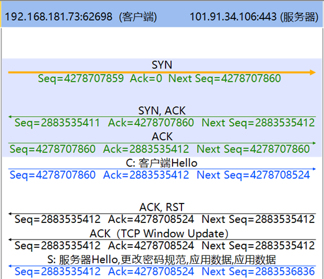

## TCP中的RST

RST：（Reset the connection）用于复位因某种原因引起出现的错误连接，也用来拒绝非法数据和请求。

RST 有什么用途？  在 TCP 连接发生异常情况时可以通过发送 RST 包告知对方关闭连接，**不必等缓冲区的包都发出去**（不像上面的FIN包），**直接就丢弃**缓存区的包发送 RST 包。而接收端收到 RST 包后，也**不必发送 ACK 包来确认**。

## 何时发送RST

它会在以下三种情况下产生：

- 目的地为某个端口的 SYN 到达服务端，但并没有服务器在该端口监听（接收端进程不存在）。
- TCP 想取消一个已有连接，即异常地关闭连接。
- TCP接收到一个数据段，但是这个数据段所标识的连接不存在。
- **防火墙策略不允许 / SYN包格式错误** , 则会话中会出现RST包

　　第一种情况：常见的例子是终端访问服务器未开放的端口，服务器回复RST报文。比如，访问Web服务器的80/443端口，如果该端口服务器未开放或者阻断了到该端口的请求报文，则服务器很可能会给终端SYN报文回应一个RST报文。

　　第二种情况：正常拆除一个已有TCP连接的方式是发送FIN，FIN报文会在所有排队数据都发出后才会发送，正常情况下不会有数据丢失，因此，这也被称为是有序释放。另外一种拆除已有TCP连接的方式就是发送RST，这种方式的优点在于无需等待数据传输完毕，可以立即终结连接，这种通过RST拆除连接的方式被称为异常释放。大多数时候服务器需要针对两种不同的拆链方式提供不同的处理方法，也有很多服务器无法识别RST方式的拆链，这时候就需要格外小心，因为一旦出现这种情况，尤其是大量终端使用RST方式拆链，可能会导致服务器侧连接无法得到有效释放，影响其正常业务侧处理能力。

　　第三种情况：TCP通过4元组（源目IP，源目端口）唯一的标识一个连接，由于TCP状态机的存在，触发TCP连接建立的第一个报文标志位一定是SYN置位，因此，当服务器接收到一个新四元组（服务器本地没有这个连接）的非SYN首包就会丢弃该报文并向终端响应一个RST报文。最后一种情况，TCP通过4元组（源目IP，源目端口）唯一的标识一个连接，由于TCP状态机的存在，触发TCP连接建立的第一个报文标志位一定是SYN置位，因此，当服务器接收到一个新四元组（服务器本地没有这个连接）的非SYN首包就会丢弃该报文并向终端响应一个RST报文。

​	还有一种情况： **小心网络中的安全设备** 。


## **小心网络中的安全设备代答RST**

有时候我们需要考虑一个问题：这个RST报文是不是真的是服务器回复的？可以检查同一条 tcp stream中ip报文的TTL值。如果能够对比RST包和SYN/ACK包的IP TTL，则可以发现这两个包的IP TTL可能不同（也有部分设备能对TCP RST包的IP TTL拟真），说明其来自于两个不同的网络位置。


当防火墙检测到需要阻断的会话时，会发送RST，这时候客户端和服务器会如何响应？

在客户端通过Wireshark抓包，应该能看到客户端发送SYN，防火墙可能先于服务器发送RST ( 同时服务器可能回复SYN-ACK) ，防火墙立即以服务器的IP发送RST，这样客户端就会终止连接，而服务器可能继续发送SYN-ACK，但被忽略，导致连接中断。

需要注意时序问题，因为旁路防火墙可能无法立即拦截，所以可能在三次握手之后才发送RST。另外，防火墙可能同时向客户端和服务器发送RST，导致双方都终止连接。

当旁路部署的防火墙代答 TCP RST 时，通过 Wireshark 抓包会观察到如下典型交互特征：

**1. 异常连接终止阶段**

- **握手阶段阻断**（参考内容中"旁路设备发送RST"场景）：

```
  客户端  → SYN → 防火墙（旁路镜像）  
  防火墙 → RST[伪造服务器IP] → 客户端  
  服务器  → SYN-ACK → 客户端（未被阻断的原始响应，被客户端认为是异常，从而忽略）
```

此时客户端同时收到 SYN-ACK 和 RST，根据 RFC 793 规定，优先处理 RST 终止连接

- **数据传输阶段阻断**：

```
  客户端  → HTTP GET → 服务器  
  防火墙 → RST[伪造服务器IP] → 客户端  
  服务器  → HTTP 200 OK → 客户端（因客户端已终止连接被丢弃）
```

**2. 关键报文特征**

- **地址伪造证据**：
  RST 包的源 IP 与真实服务器 IP 一致，但 MAC 地址指向防火墙物理接口
  TTL 值与服务器真实响应存在差异（如服务器 TTL=64，防火墙 RST 的 TTL=128）
- **序列号异常**：
  在三次握手未完成时，防火墙发送的 RST 包序列号为 0（不符合 RFC 793 要求）
  已建立连接中的 RST 包序列号可能超出当前窗口范围

**3. 流量对比分析**
通过对比防火墙前后路径抓包可发现：

- 客户端侧 Wireshark 显示完整的请求发出 + RST 接收
- 服务器侧 Wireshark 显示请求正常到达，但无 RST 生成记录
- 网络中间节点镜像流量显示防火墙在 0.3ms 内完成策略匹配并注入 RST

**4. 协议栈行为表现**
客户端收到 RST 后会立即释放连接资源：

- 本地 socket 状态从 SYN_SENT 直接变为 CLOSED
- 应用层收到 ECONNRESET 错误（如 Java 抛出 Connection reset 异常）
- 若客户端尝试重试连接，相同 RST 阻断过程将循环发生

例如下图描述了一种更加容易理解的旁路阻断：

客户端发送`ClientHello`包后（https, TLS握手阶段），中间的旁路设备阻断了客户端，代替服务器向客户端回复了RST报文（但未向服务器发送RST），导致服务器认为会话未中断，还在继续发送后续`ServerHello`数据包：



总之，如果会话过程中出现RST包，需要考虑该RST包是否由中间旁路阻断设备发出，可以通过该RST包的RST位、序列号、IP TTL等方式，或是直接多点抓包对比分析，综合判断。 

## 收到RST报文如何处理

收到RST报文，除了SYN-SENT状态，都需要校验SEQ字段是否在接收窗口；SYN-SENT状态下，如果RST的确认了刚刚发送的SYN报文，RST才有效；

校验了RST报文后，如果是在LISTEN状态则保持该状态不需要改变；
如果是在SYN-RECIEVED状态且之前在LISTEN状态，恢复为LISTEN状态，如果之前为SYN-RECIEVED状态且之前不是LISTEN状态，则CLOSED；
其他状态，关闭连接通知用户，状态变为CLOSED


以下摘自[为什么服务器突然回复RST——小心网络中的安全设备 - 豫让 - 博客园](https://www.cnblogs.com/yurang/p/11980464.html)

## TCP reset及原因

### 无故障时发送reset

```
    TCP关闭连接的标准方式是通过FIN和FIN-ACK信号。为了关闭连接，用户需要四个报文：来自一方的FIN/ACK和ACK，以及另一方的同样报文。当你打开一个网页，可能同时打开了数十个连接（主页，新闻，广告，定期更新的图片等），要关闭所有这些有时需要数百个FIN和FIN-ACK报文。
    为了防止其发生，web服务器在很多情况下会在发送请求数据之后用reset断开连接。这是标准的做法，并取决于应用程序
```

### 有故障时发送reset（并不一定是通信故障）

- 防火墙发送的reset：

  当远端服务器尝试打开连接但没有结果时，也许会看到返回RST信号。这是防火墙阻隔连接的情况。下图中，可看到发送的每一个SYN都返回以RST。

- 由于收发一方有问题发送的reset：

可能的原因如：

- 五个连续没有收到ACK回复的重传。当发送方没有收到任何重传回复，它就会发送一个reset信号到对端，告知其断开连接。
- 另一个原因是连接之上几分钟都没有任何数据（分钟数取决于系统默认）。打开连接的一方通常会发送reset（但并不总是会这样做，取决于实现方式）。