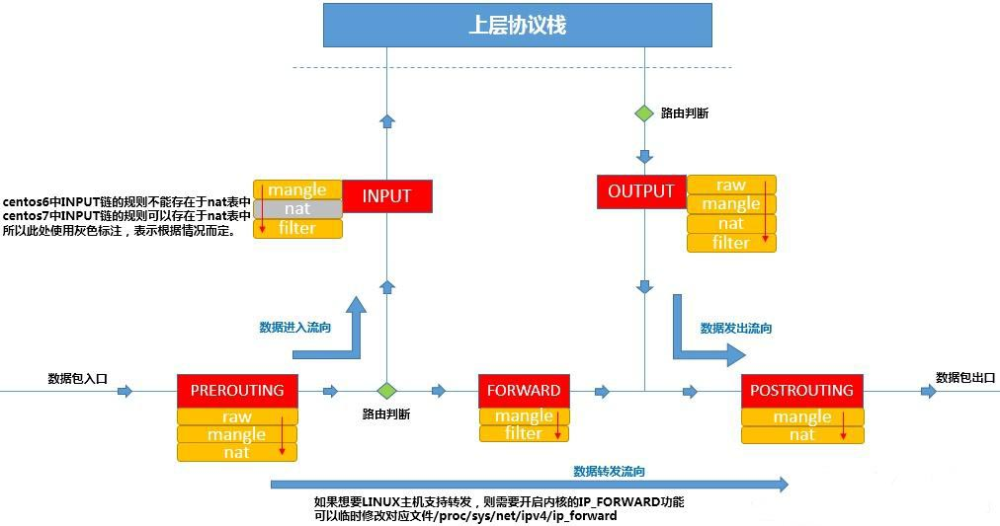

## 路由策略（使用ip rule命令操作路由策略数据库）

基于策略的路由比传统路由在功能上更强大，使用更灵活，它使网络管理员不仅能够根据目的地址而且能够根据报文大小，应用或IP源地址等属性来选择转发路径。

ip rule命令：

```bash
Usage: ip rule [ list | add | del ] SELECTOR ACTION （add 添加；del 删除； llist 列表）
 
SELECTOR := [ from PREFIX 数据包源地址] [ to PREFIX 数据包目的地址] [ tos TOS 服务类型]
            [ dev STRING 物理接口] [ pref NUMBER ] [fwmark MARK iptables 标签]
 
ACTION := [ table TABLE_ID 指定所使用的路由表] [ nat ADDRESS 网络地址转换]
          [ prohibit 丢弃该表| reject 拒绝该包| unreachable 丢弃该包]
 
[ flowid CLASSID ]
 
TABLE_ID := [ local | main | default | new | NUMBER ]

#例子1：通过路由表 inr.ruhep 路由来自源地址为192.203.80/24的数据包
ip rule add from 192.203.80/24 table inr.ruhep prio 220 
 
#例子2：把源地址为193.233.7.83的数据报的源地址转换为192.203.80.144，并通过表1进行路由
ip rule add from 193.233.7.83 nat 192.203.80.144 table 1 prio 320
```

在 Linux 系统启动时，内核会为路由策略数据库配置三条缺省的规则：

- 0：匹配任何条件，查询路由表local(ID 255)，该表local是一个特殊的路由表，包含对于本地和广播地址的优先级控制路由。rule 0非常特殊，不能被删除或者覆盖。

- 32766：匹配任何条件，查询路由表main(ID 254)，该表是一个通常的表，包含所有的无策略路由。系统管理员可以删除或者使用另外的规则覆盖这条规则。

- 32767：匹配任何条件，查询路由表default(ID 253)，该表是一个空表，它是后续处理保留。对于前面的策略没有匹配到的数据包，系统使用这个策略进行处理，这个规则也可以删除。

**注：**不要混淆路由表和策略：规则指向路由表，多个规则可以引用一个路由表，而且某些路由表可以策略指向它。如果系统管理员删除了指向某个路由表的所有规则，这个表没有用了，但是仍然存在，直到里面的所有路由都被删除，它才会消失。


Linux 系统中，可以自定义从 1－252个路由表，其中，linux系统维护了4个路由表：

- **0#表：** 系统保留表

- **253#表：** defulte table 没特别指定的默认路由都放在改表

- **254#表：** main table 没指明路由表的所有路由放在该表

- **255#表**： locale table 保存本地接口地址，广播地址、NAT地址 由系统维护，用户不得更改

路由表的查看可有以下二种方法：

```tex
ip route show table <table_number>
 
ip route show table <table_name>
```

路由表序号和表名的对应关系在 `/etc/iproute2/rt_tables`文件中，可以手动编辑，路由表添加完毕及时生效，示例如下：

```bash
#例1：在一号表中添加默认路由为 192.168.1.1
ip route add default via 192.168.1.1 table 1 
 
#例2：在一号表中添加一条到 192.168.0.0 网段的路由为 192.168.1.2
ip route add 192.168.0.0/24 via 192.168.1.2 table 1 
```

## 路由表（使用ip route命令操作静态路由表）

所谓路由表，指的是路由器或者其他互联网网络设备上存储的表，该表中存有到达特定网络终端的路径，在某些情况下，还有一些与这些路径相关的度量。路由器的主要工作就是为经过路由器的每个数据包寻找一条最佳的传输路径，并将该数据有效地传送到目的站点。由此可见，选择最佳路径的策略即路由算法是路由器的关键所在。为了完成这项工作，在路由器中保存着各种传输路径的相关数据--路由表，供路由选择时使用，表中包含的信息决定了数据转发的策略。

## ip rule，ip route，iptables 三者之间的关系

Iproute2是一个在Linux下的高级网络管理工具软件，提供了 ip 、tc 、ss 等组件，集成了原有的 ifconfg 、arp 、route 、netstat 等多种命令的功能，并新增了很多特性。

ip rule , ip route 属于iproute2这个网络管理工具包中的命令。

**iptables**是运行在[用户空间](https://zh.wikipedia.org/wiki/使用者空間)的应用软件，通过控制[Linux内核](https://zh.wikipedia.org/wiki/Linux內核)[netfilter](https://zh.wikipedia.org/wiki/Netfilter)模块，来管理网络数据包的处理和转发。对于 [IPv6](https://zh.wikipedia.org/wiki/IPv6) 数据包，则使用类似的 **ip6tables** 命令。

**iptables**其实**不是真正的防火墙**，它只是一个管理工具，用户通过iptables管理工具，将用户的安全设定执行到对应的"安全框架"中，这个"安全框架"才是**真正的防火墙**，这个框架的名字叫**netfilter。**



**注：图中 “路由判断” 就是使用ip rule，ip route设置的规则，其中ip route配置的路由表服务于ip rule配置的规则。**


以一例子来说明：

一台Linux服务器作为出口网关，eth1: 10.0.0.1,   eth2:  20.0.0.1 

要求内网192.168.0.1 ~ 100 的客户端使用 10.0.0.1 网关上网 （电信），其他IP使用 20.0.0.1 （网通）上网。

1，首先要在网关服务器上添加一个默认路由，当然这个指向是绝大多数的IP的出口网关：

```bash
ip route add default via 20.0.0.1 dev eth2
```

2，之后通过 ip route 添加一个路由表：

```bash
ip route add table 3 via 10.0.0.1 dev eth1
```

eth1 是 10.0.0.1 所在的网卡, 3 是路由表的编号

3，之后添加 ip rule 规则：

```bash
ip rule add fwmark 3 table 3 
```

`fwmark 3 `是标记，`table 3` 是路由表3 上边。 意思就是凡是标记了 3 的数据使用 table3 路由表

4，之后使用 iptables 给相应的数据打上标记：

```bash
iptables -A PREROUTING -t mangle -i eth1 -s 192.168.0.1 - 192.168.0.100 -j MARK --set-mark 3
```

